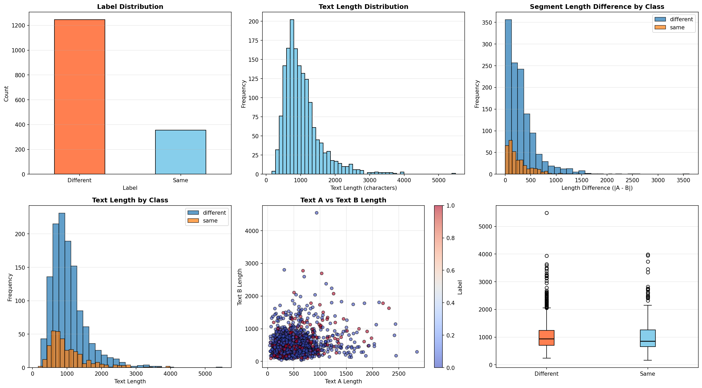

<table>
  <caption>
    Class Competition Info
  </caption>
  <thead>
  <tr>
    <th></th>
    <th></th>
  </tr>
  </thead>
<tbody>
  <tr>
    <th><b>Leaderboard score</b></th>
    <td>0.60722</td>
  </tr>
  <tr>
    <th><b>Leaderboard team name</b></th>
    <td>Yanyan Dong</td>
  </tr>
  <tr>
    <th><b>Kaggle username</b></th>
    <td>yanyandong17</td>
  </tr>
  <tr>
    <th><b>Code Repository URL</b></th>
    <td>https://github.com/uazhlt-ms-program/ling-582-fall-2025-class-competition-code-yanyan-dong</td>
  </tr>
</tbody>
</table>

## Description of my preliminary approach
My current approach uses sentence-level embeddings and a gradient boosting classifier.
- First of all, I split each input pair on the [SNIPPET] delimiter to obtain two separate text segments.
- Encode both segments using the all-mpnet-base-v2 SentenceTransformer model.
- I construct contrastive features, including absolute difference, elementwise product, and cosine similarity between embeddings.
- Then I train a LightGBM binary classifier using these features.

## Planned improvements
- Try to add some features.
- Experimenting with additional models.

---

## Task summary

This task is a text classification task for authorship identification. We need to determine whether two text segments were written by the same author or by different authors.

#### dataset overview

- Total samples: 1,601 training pairs
  - Same author pairs (positive class): 356 (22.2%)
  - Different author pairs (negative class): 1,245 (77.8%)
- Test samples: 899 pairs
- Data source: [Project Gutenberg](https://www.gutenberg.org/) literary texts, download from [Kaggle](https://www.kaggle.com/competitions/ling-582-fa-2025-course-competition/data)

#### Task Formulation

Each input is a pair of text segments separated by a `[SNIPPET]` delimiter: `[TEXT_A] [SNIPPET] [TEXT_B]`

#### Task's Challenge

1. Two texts on similar topics may have high semantic similarity but be written by different authors. 
2. Class is imbalance. The dataset has a 3.5:1 ratio of different-author to same-author pairs, which can bias models toward the majority class.
3. Author identification relies on capturing writing style (word choices, punctuation habits, sentence length patterns) rather than semantic content. These features are often subtle and context-dependent.

#### Evaluation Metric

- Macro F1 Score: Unweighted mean of F1 scores for each class. This metric is appropriate for imbalanced datasets as it treats both classes equally.

## Exploratory data analysis

#### Dataset Statistics

The dataset contains 1,601 training samples with a significant class imbalance:

| Metric                            | Value        |
| --------------------------------- | ------------ |
| Total training samples            | 1601         |
| Same author pairs (positive)      | 356 (22.2%)  |
| Different author pairs (negative) | 1245 (77.8%) |
| Class imbalance ratio             | 3.5:1        |
| Total test samples                | 899          |

#### Text Length Analysis

Text segments vary considerably in length, which is important for feature engineering:

| Statistic     | Value (characters) |
| ------------- | ------------------ |
| Mean length   | 1048               |
| Median length | 920                |
| Min length    | 164                |
| Max length    | 5491               |
| Std deviation | 546                |

#### Text Segments

- **Text A (before SNIPPET)**: mean = 511 characters
- **Text B (after SNIPPET)**: mean = 528 characters

### Findings from EDA

1. Class Imbalance: The dataset is heavily skewed toward different-author pairs (77.8% vs 22.2%). This imbalance affects model learning and requires techniques like class weighting to prevent the classifier from simply predicting the majority class.

2. A insight discovered from analyzing segment lengths:

   - Different-author pairs: mean length difference = 323 characters, median = 245
   - Same-author pairs: mean length difference = 276 characters, median = 178
   - Same-author pairs tend to have more similar segment lengths. This suggests that authors maintain consistency in their writing lengths, so it might be a useful stylistic feature for classification.
   
3. Data Quality

   - Missing values: 0

   - Duplicate samples: 0

   - The dataset is clean with no data integrity issues.


4. Diversity Measures

   - Text length diversity differs slightly between classes:
     - Different-author pairs: std dev = 527, range = 5,254 characters
     - Same-author pairs: std dev = 610, range = 3,824 characters

   Same-author texts show slightly higher variability, but both classes have substantial diversity in text lengths.

### Data Visualizations



- Plot 1 (top-left): Label distribution showing *class imbalance*
- Plot 2 (top-middle): Overall text length distribution (right-skewed)
- Plot 3 (top-right): Text length by class (similar distributions)
- Plot 4 (bottom-left): Text A vs Text B length scatter plot (colored by class)
- Plot 5 (bottom-middle): Segment length difference distribution by class
- Plot 6 (bottom-right): Box plot of text lengths by class

## Approach

#### Overview

I split each text pair on the `[SNIPPET]` delimiter and encode both segments using the all-mpnet-base-v2 sentence embedding model. Then I construct contrastive features from the embeddings and train a logistic regression classifier.

#### Approach

##### 1. Text Segmentation

- Split each example into `TEXT_A and TEXT_B` using the `[SNIPPET]` delimiter

##### 2. Embedding Encoding

- Encode both segments with `all-mpnet-base-v2` (SentenceTransformers)
- Produces 768-dimensional embeddings per segment

##### 3. Feature Engineering

- Absolute difference between embeddings: `|emb_a - emb_b|` (768 dims)
- Element-wise product: `emb_a * emb_b` (768 dims)
- Cosine similarity: `cos_sim(emb_a, emb_b)` (1 dim)
- Segment length difference: `|len(text_a) - len(text_b)|` (1 dim)
  - Insight from EDA: same-author pairs have more similar lengths
- Segment length ratio: `min(len(a), len(b)) / max(len(a), len(b))` (1 dim)
- **Total**: 1,539 features

##### 4. Classification

- Logistic Regression with `class_weight='balanced'`
- Handles the 3.5:1 class imbalance

#### Motivation for Approach

- Embeddings capture semantic meaning of texts
- Length features capture author-specific writing patterns (from EDA)
- Logistic regression is simple, robust, and fast
- Class weighting prevents bias toward majority class

#### Key Improvements

1. Used class_weight='balanced' and threshold tuning to handle class imbalance.
2. Added length features, based on EDA finding that same-author pairs have similar lengths.
3. Tested LightGBM, XGBoost, Random Forest, and Logistic Regression, selelcted Logistic Regression, which has the best performance (0.60722).
4. Implemented 5-fold stratified cross-validation to validate generalization.

## Results

#### Leaderboard Score

- Macro F1 Score: **0.60722**

#### Cross-Validation

I used 5-fold stratified cross-validation to validate model generalization:

| Fold    | F1 Score | Precision | Recall  |
| ------- | -------- | --------- | ------- |
| 0       | 0.6069   | 0.6018    | 0.6196  |
| 1       | 0.6411   | 0.6370    | 0.6834  |
| 2       | 0.6132   | 0.6084    | 0.6371  |
| 3       | 0.5941   | 0.5899    | 0.6039  |
| 4       | 0.6056   | 0.6021    | 0.6311  |
| Mean    | 0.6122   | 0.6079    | 0.6350  |
| Std Dev | ±0.0157  | ±0.0157   | ±0.0267 |

The cross-validation results show consistent performance across folds with low variance, indicating that the model generalizes well.

#### Validation Set Performance (80-20 Split)

- Macro F1 Score: 0.6580
- Accuracy: 0.7303 (73.03%)
- Total validation samples: 321

#### Confusion Matrix

```
              Predicted Different  Predicted Same
Actual Different      188               62
Actual Same            26               45
```

Out of 321 validation samples, the model correctly classified 233 (72.6% accuracy), with 88 total errors.

#### Feature Importance

The logistic regression model weights features by their coefficients. The top 10 important features are:

| Rank | Feature                          | Importance |
| ---- | -------------------------------- | ---------- |
| 1    | Feature 1536 (length ratio)      | 2.9758     |
| 2    | Feature 256                      | 1.6567     |
| 3    | Feature 466                      | 1.2961     |
| 4    | Feature 531                      | 1.2573     |
| 5    | Feature 442                      | 1.1227     |
| 6-10 | Features 348, 350, 493, 225, 166 | 1.01-1.11  |

Feature 1536 is the segment length ratio, which has the highest importance. This confirms that our EDA-informed length features are valuable for the task.

## Error analysis

#### Overview

The model made 88 errors out of 321 validation samples. Most errors (62) are false positives where the model incorrectly predicts "same author", while 26 are false negatives where it misses actual same-author pairs.

#### False Positives (62 errors)

The model frequently predicts "same author" for texts by different authors.

The embedding features capture semantic similarity well. When two texts have similar narrative style or vocabulary, the model incorrectly assumes they are by the same author.

**Example 1**: 

```
Text A: "Eventually Joe hid his hands in the sleeves of his robe and turned 
with an air of polite inquiry. Now we get down to bus..."

Text B: "Me?" Hellman asked. "Why not you?" "You picked it." "I prefer just 
looking at it," Hellman said with dignity. "I'm no..."
```

Both use dialogue-heavy style, causing a false positive prediction.

**Example 2**:

```
Text A: "Open the portal," Fred said. Wrenching metal curlers from her 
permanently waved hair, Miss Tapp bounded to the door. Sh..."

Text B: "Suddenly that seemed to make Conrad real. Martin felt a vague stirring 
of alarm. He kept his voice composed, however. "..."
```

Similar tone triggers a false positive despite different authors.

#### False Negatives (26 errors)

The model sometimes fails to identify same-author pairs, especially when they differ in topic or style.

When the same author writes about different topics, the embeddings detect less similarity. The model needs stylistic features beyond just content.

**Example 1**:

```
Text A: "We'll code the right poop, and the system will compare it with the 
actual raw data. Feedback will be to a master control..."

Text B: "Trapped, I'd have to drink. We ordered, and I mulled it over. Waited, 
but she said nothing. The drinks came. I shook sev..."
```

Very different topics (technical vs conversational) cause a false negative.

**Example 2**:

```
Text A: "He's got ideas too. He's only been here a couple of days. He's 
passionately fond of whist; couldn't we get up a game, eh..."

Text B: "Who, in the name of what Law, would think of disputing my full 
personal right over the fortnight of life left to me? Wh..."
```

Different tone and content mask the same author.

## Reproducibility

See README file.


## Future Improvements

#### 1. Stylometric Features

First for improvement is adding explicit stylometric features. These features might capture author specific writing patterns that embeddings miss:

- Punctuation frequencies (commas, periods, question marks)
- Function word frequencies (the, a, and, but)
- Character n-grams (3-4 character sequences)

#### 2. Try LLMs

Instead of hand-crafted features, we could try LLMs:

- Larger LLMs (Claude, GPT-4): Could identify authorship patterns through reasoning
- Fine-tuned smaller LLMs (Llama-3-8B, Mistral): Could be fine-tuned specifically for authorship identification
- Prompt engineering: Design prompts that explicitly ask the LLM to identify authorship clues
- Few-shot Learning: Provide the model with a few examples of same-author and different-author pairs before predicting.
