<table>
  <caption>
    Class Competition Info
  </caption>
  <thead>
  <tr>
    <th></th>
    <th></th>
  </tr>
  </thead>
<tbody>
  <tr>
    <th><b>Current Best Leaderboard Score</b></th>
    <td>0.52291</td>
  </tr>
  <tr>
    <th><b>Leaderboard Name</b></th>
    <td>Ethan Parks</td>
  </tr>
  <tr>
    <th><b>Kaggle Username</b></th>
    <td>ethanparks</td>
  </tr>
  <tr>
    <th><b>Code Repository URL</b></th>
    <td>https://github.com/uazhlt-ms-program/ling-582-fall-2025-class-competition-code-edjpman.git</td>
  </tr>
</tbody>
</table>


## Ensemble Stylometry Modeling

<br />
<br />

#### Task Summary

The class competition involves pairwise authorship-attribution to snippets of paired text that are sourced from the Project Gutenberg corpus. Authorship is not focused on the specific author but rather a binary label of whether the author of each text snippet is the same. The text used for the analysis was typically limited in nature from a few words to a few short sentences. As a result there is an emphasis on linguistic and stylometric features that can be captured and less focus on broader writing styles over a larger corpus of the author's text. 

Datasets for the modeling task are limited in size only spanning a few thousand records. As a result, the architecture selected for the modeling portion of the course was selected to identify the key generalizable patterns of the authors writing while ensuring the model does not overfit to the dataset.

<br />

##### Related Tasks

Despite remaining specific to NLP concepts, the modeling exercise for the competition has crossover with many other tasks. The most similar is that of authorship verification in a non-pairwise manner. This can include use cases such as grading text for the likelihood of being generated by a robot, or the contents of some body of text belonging to someone in an extremist group. Additionally, contrastive tasks also share similarities such as plagiarism checks in which one corpus of text is directly compared with the other to determine the semantic and linguistic similarity between the two. The focus on the linguistic attributes of the text for some classification purposes are what drive the relation between the competition and other use cases, in which similar strategies can be leveraged for both.

<br />


##### Tasks Challenges

Several task challenges exist for the specific competition modeling exercise. These are typically derived from the actual dataset, as the actual modeling task is not necessarily novel, with many documented strategies existing. 

The first and most foundational challenge of the modeling task is the limited size of the training dataset. While the size is not necessarily a problem for simple linear models, this places the emphasis on the ability to extract very meaningful features from the text that are linearly separable. This is a strong assumption to start off with as models may be prone to under or over-fitting given the limited examples of unique text scenarios. 

Another critical challenge stems from the limited dataset size in terms of the diversity in the content included. The Project Gutenberg source includes a vast number of writings created by various authors, which if the training dataset randomly samples from, could introduce too much noise into the dataset for determining clear patterns. Text snippets that are brief can additionally compound these issues given limited expression in the data that may be used to decipher between noise and signal. This can cause models to produce consistent weak classification performance despite optimal modeling conditions. 

A final major challenge that can significantly impact performance is the imbalance in the authorship classes. Currently 77.8% (N=1245/1601) is of no match and 22.2% (N=356/1601)  matching in the training dataset. This is a considerable hurdle given the already small size of the dataset, and a major issue of overfitting if the model is too expressive. The imbalance also limits the architectural possibilities for the scenario and places more emphasis on features from the text data and regularization of the model.

<br />

##### State-of-the-Art Approaches

There are several approaches to the competition task that could earn the title of “state of the art” (SotA) and involve various simple and complex models. Some approaches focus more on the development of robust linguistic features and simpler models, whereas others rely more heavily on the model to determine the appropriate patterns out of raw data. 

One SotA approach is titled “BertAA” and blends both aspects of the robust modeling architecture of rich linguistic features (Fabien et al. 2020). To sidestep lengthy feature development through traditional statistical linguistic methods such as TF-IDF, average word length, punctuation, and others, a hybrid deep learning based method through a BERT based encoder was utilized. 

The architecture specifically involves the authorship-attribution data simultaneously passing through three different channels before a final logistic regression provides the output class probabilities. These channels include a pre-trained BERT model with a dense classifier head, a stylometry features logistic regression classifier, and a hybrid features (n-gram based) logistic regression classifier. Output class probabilities of the three channels are ultimately the input into the final logistic regression model to predict the authorship.

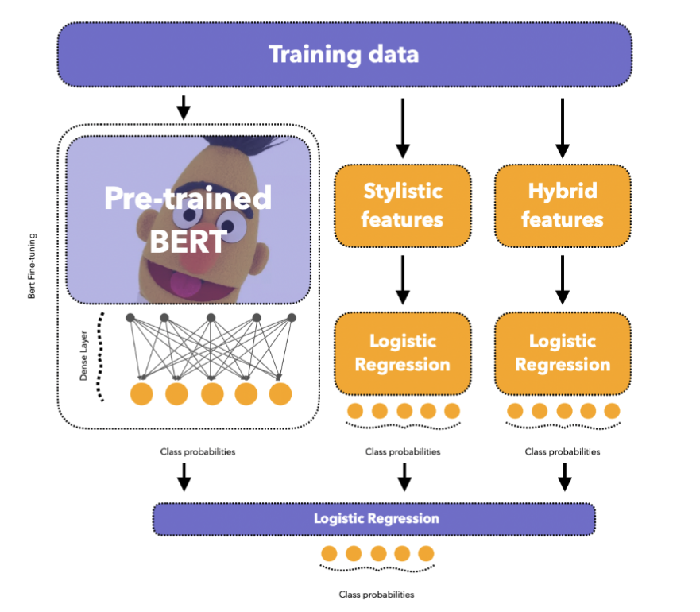

<p style={{ fontSize: "0.85rem", textAlign: "center", marginTop: "-0.5rem" }}> 
  Figure 1: BertAA model architecture. Adapted from Fabien et al. (2020). 
  https://aclanthology.org/2020.icon-main.16/ 
</p>

Performance of the modeling approach across three different authorship-attribution datasets resulted in an accuracy improvement over current SotA approaches by up to 5.3%, with the BertAA model with stylometry and hybrid features improving a macro-averaged F1 score by 2.7% over an encoder only BertAA. This highlights the ability of deep learning methods to make meaningful representations of raw data for downstream tasks.

<br />

##### Competition Approach

My own approach to the competition task closely resembles that of the BertAA paper but with slight variations based on the data and the time constraints of the course. The hybrid ensemble approach was specifically selected to capture the semantic meaning of the authors texts while also incorporating specific linguistic features that may help distinguish the authors' various styles. Please reference the approach section for specific model details. 

<br />

#### Exploratory Data Analysis

##### Embeddings Analysis

The semantic embeddings were created from the 110M parameter MPNet model (Song et al., 2020) for the richest semantic representation of the text. The text snippets in each pair were then contrasted based on their cosine similarity. Similarly the quantitative stylometric features are combined into a single raw feature vector and then scaled via a z-score normalization method. The two scaled snippets elementwise difference is obtained to compute a distance score in terms of their stylistic contents. The distance score is computed through a L2 Norm of the scaled difference vector.

First the semantic embeddings of the training dataset are visualized through a t-distributed stochastic neighbor embedding (tSNE) method to preserve the local structure for more distinct groupings. In a scenario with good data quality and semantic nuance one larger group would stand apart from random noise highlighting the semantic similarity between the matching authorship posts. 

After visualization, there appear to be a lack of distinct clusters with only limited structure existing. Of the limited structure multiple groups also appear to exist within the embeddings which may highlight the source of text from multiple distinct bodies of text or authors. The level of noise observed in the visualization highlights a lack of predictive power that raw semantic embeddings may have in separating authorship. 

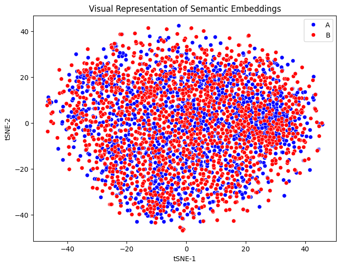

The cosine-similarity score comparison of the snippet pairs is additionally plotted to highlight the predictive power of features. Cosine-similarity forms an approximately normal distribution around a score of 0.3, highlighting a low semantic similarity between most text pairs. If semantic similarity was highly correlated with the two authorship classes, we would expect to see a more distinct bimodal distribution with peaks around both high and low similarity scores.

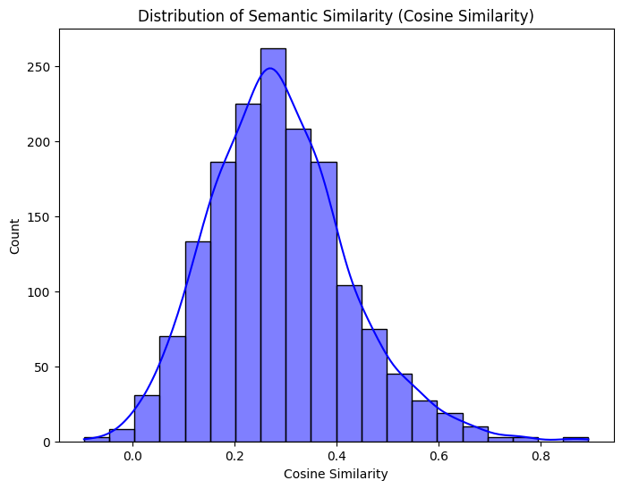

By computing the mean cosine similarity score between the two classes, there does appear to be some difference in which more semantic similar snippets are associated with the positive label class (i.e. 0.264 for class 0 versus 0.365 for class 1). A Mann-Whitney test confirms a rejection of the null hypothesis that the two semantic classes come from the same group therefore only random differences between the two groups will exist. The rank-biseral effect size of this difference is moderate in nature suggesting some predictive power.

Furthermore by authorship class, the semantic similarity is much more dispersed among the matching authorship versus the non-matching authorship that is largely concentrated around the 0.3 score. The disbursed scores of the matching class indicates a potential for the semantic features to correlate with the positive class but without a high degree of strength.

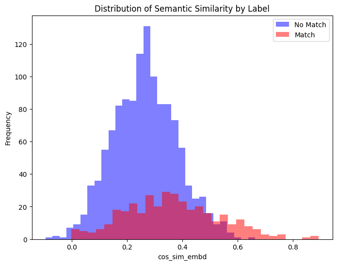

The stylometric embeddings were analyzed in the same fashion to determine whether meaningful signals may exist within the features for the model to use. The tSNE visualization of the embeddings show very little broad clustering and instead multiple weak small clusters. These weak local clusters highlight the lack of distinct generalizable features that the model can use to distinguish between the authorship classes.

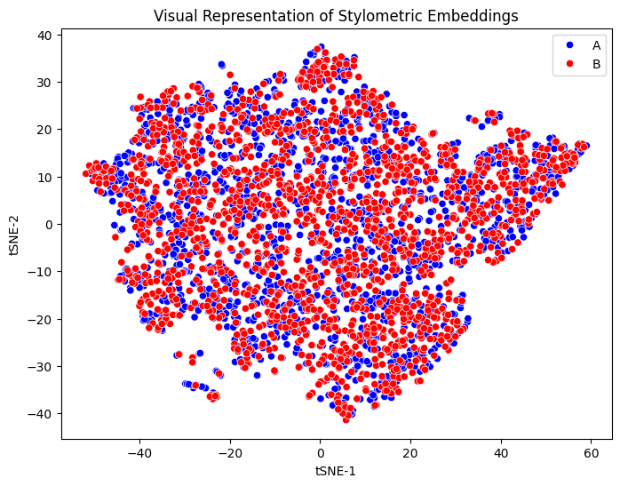

A distribution of the L2 Norm “similarity scores” was produced displaying a heavily right skewed distribution. The heavily skewed distribution exemplifies a lack of diverse textual features that could be used to separate between the authorship classes. Similar to the semantic embeddings, with better features and data quality a bimodal distribution would be expected with peaks around the high and low scores displaying a strong association between stylistic similarity and the matching authorship.

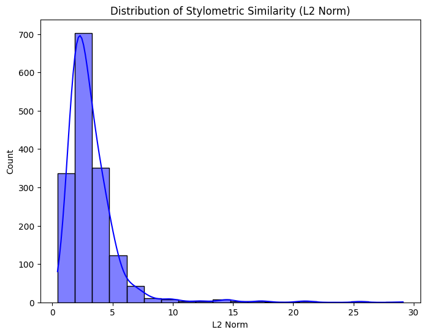

Despite a poorer feature diversity than the semantic similarity, there still appears to be more stylistic similarity for snippets with a matching authorship (i.e. a mean of 3.349 for class 0 versus 2.893 for class 1). A Mann-Whitney test confirms a rejection of the null hypothesis that the two stylometric classes come from the same group therefore only random differences between the two groups will exist. The rank-biseral effect size of this difference is minimal in nature suggesting very little predictive power.

Lastly, comparing the distribution of stylometry similarity scores between the two classes reveals little difference in the diversity between the two. This largely refutes the slight increase in similarity for the positive class that was previously mentioned, and may be a result of a few small highly similar examples influencing the mean. Overall, this comparison provides additional evidence that the stylistic features will have little predictive influence and thus require additional work or alternative representation. 

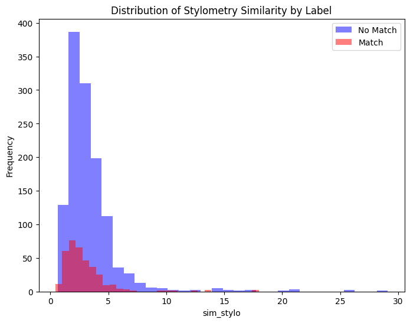

<br />

##### Stylometric Feature Diversity Analysis

The following individual features were developed to be included into the stylometric vector representation of the snippets. They include various quantitative linguistic and textual measures and are detailed in terms of their diversity:

- Punctuation Ratio: The punctuation ratio is heavily right skewed but does display a moderate amount of diversity. The feature may be beneficial for only a slight increase in predictive power as both positive and negative classes are likely to have similar scores.

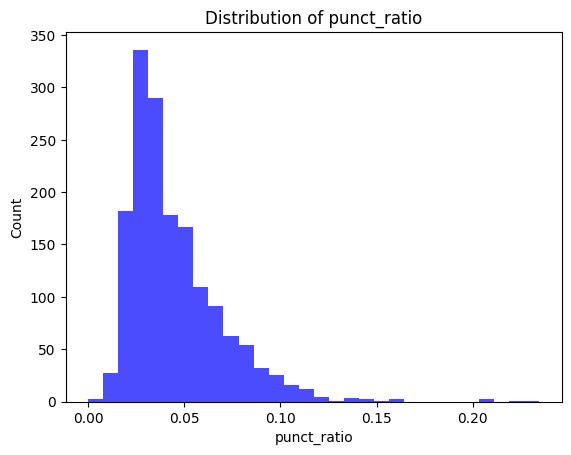

- Numerical Digit Ratio: Almost no diversity exists for the feature in the training dataset indicating that the use of digits in the text are relatively rare and not likely to be predictive in a meaningful way.

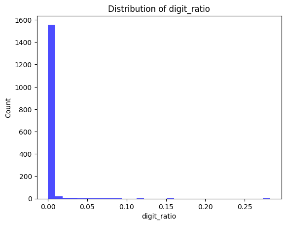

- Upper-case Letter Ratio: Almost no diversity exists for the feature in the training dataset indicating that the use of uppercase letters in the text are relatively rare and not likely to be predictive in a meaningful way.

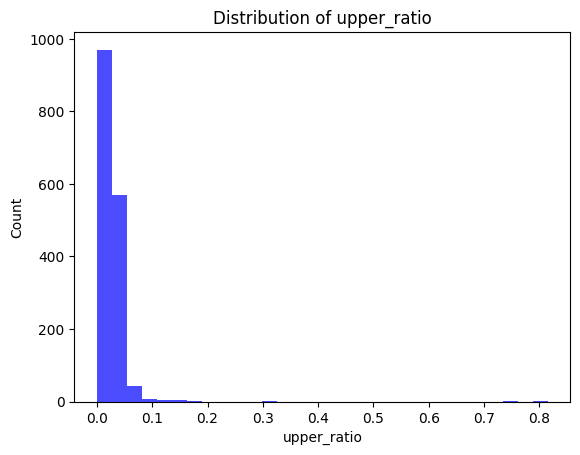

- Stopword Ratio: The stopword ratio is approximately normally distributed and displays a moderate amount of diversity. The feature may be beneficial only for a slight increase in predictive power as both positive and negative classes are likely to have similar scores.

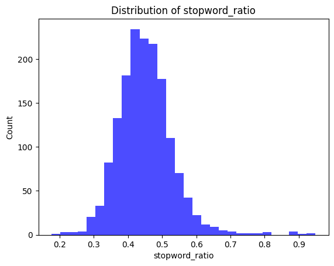

- Comma-to-Period Ratio: Very little diversity exists for the feature in the training dataset indicating that the use of longer complex sentences in the text are relatively rare and not likely to be predictive in a meaningful way.

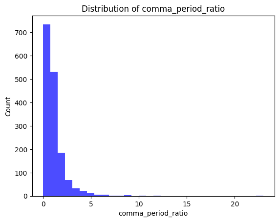

- Average Word Length: The measure of average word length is approximately normally distributed and displays a moderate amount of diversity. The feature may be beneficial only for a slight increase in predictive power as both positive and negative classes are likely to have similar scores.

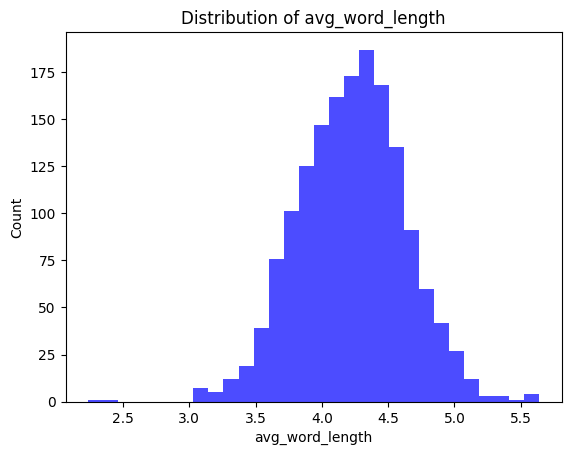

- Mean Sentence Length: The measure of mean sentence length is heavily right skewed but does display a moderate amount of diversity. The feature may be beneficial for only a slight increase in predictive power as both positive and negative classes are likely to have similar scores.

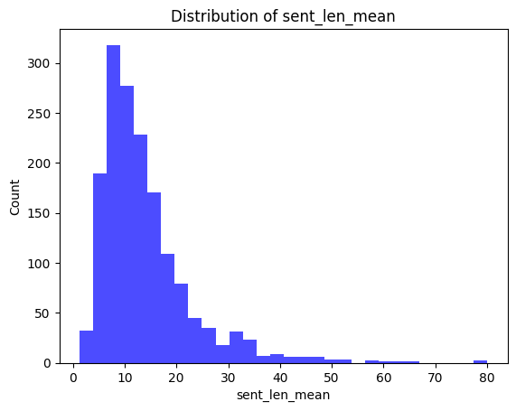

- Sentence Length Variance: Almost no diversity exists for the feature in the training dataset indicating that the text follows a high degree of uniformity and is not likely to be predictive in a meaningful way.

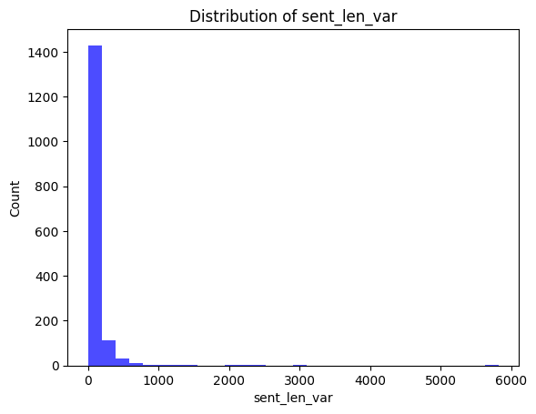

- Lexical Diversity: The measure of lexical diversity is approximately normally distributed but displays very little diversity. As a result, the feature is not likely to be predictive in a meaningful way.

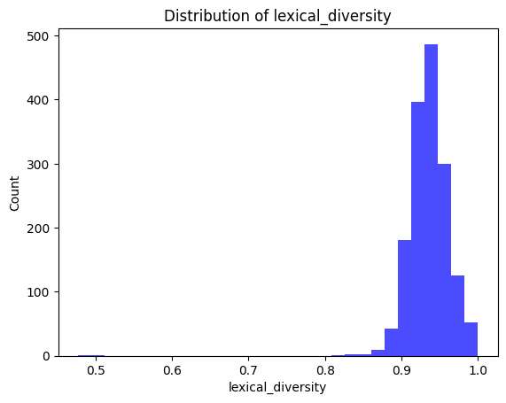

- Verbosity: The measure of verbosity is heavily left skewed but does display a moderate amount of diversity. The feature may be beneficial for only a slight increase in predictive power as both positive and negative classes are likely to have similar scores.

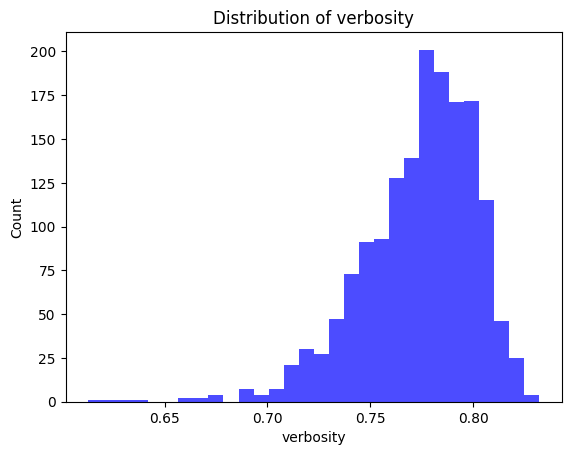

<br />

##### Stylometric Feature Relationships

To better understand the strength of the derived linguistic features, a point biserial correlation analysis was performed. The correlation coefficient specifically measures the strength and direction of the relationship between the features on the binary outcome. A positive value indicates that higher values of the feature tend to be associated with the positive class, whereas a negative coefficient indicates that higher values of the feature are associated with the negative class. The accompanying p-value indicates whether the relationship is statistically significant.

Across all derived stylistic features the correlation coefficients are close to 0 with p-values above typical significance thresholds (e.g. p < 0.05). This points toward no features having a strong and reliable linear relationship with the outcome labels, and often a weak effect size given the small correlation coefficients. This reinforces the need for further feature development, or more complex non-linear approaches to modeling the features.

| feature              | pbs        | p_val    |
|----------------------|------------|----------|
| punct_ratio          | -0.044094  | 0.077765 |
| digit_ratio          | -0.014349  | 0.566144 |
| upper_ratio          | -0.020630  | 0.409426 |
| stopword_ratio       | -0.016797  | 0.501840 |
| comma_period_ratio   | 0.032247   | 0.197183 |
| avg_word_length      | -0.008677  | 0.728642 |
| sent_len_mean        | 0.044971   | 0.072036 |
| sent_len_var         | 0.024436   | 0.328508 |
| lexical_diversity    | -0.018355  | 0.463010 |
| verbosity            | 0.019109   | 0.444831 |

<br />

##### Semantic Example Comparison

Semantic similarities and differences were investigated to determine the fidelity of representations that the encoder model produced. Two of the highest and lowest semantic similarity pairs by a measure of cosine-similarity were selected for the comparison. 

Of the high similarity pairs aspects such as overlapping content, shared vocabularies, narrative tone, and thematic content were all observed between the two example pairs. In the first pair the texts include nearly identical language such as “Obedience was not in him, and so….” and likely are from the same text corpus capturing nearly all of these similarities. 

In the second snippet the same thing was experienced with the same language existing such as “Besides, levitation is much more difficult…”. Despite both examples having nearly matching text, the same narrative positions continuing to be third and first person respectively, and descriptive language like "feebleness" and “marshy” all help strengthen the similarity scores that may enhance the model’s ability to assign the correct authorship flag. 

The text snippets with the highest semantic similarity are detailed below:

> ***High Similarity Example #1***: Cosine-Similarity [0.8933]
>
> - **A**: If he were the boy again knowing all he knew today, still the flaw would be there and sooner or later the same thing must have happened that had happened twenty years ago. He had been born for a wilder age, when men took what they wanted and held what they could without respect for law. Obedience was not in him, and so— As vividly as on that day it happened he felt the same old surge of anger and despair twenty years old now, felt the ray-gun bucking hard against his unaccustomed fist, heard the hiss of its deadly charge ravening into a face he hated. He could not be sorry, even now, for that first man he had killed.
>
> - **B**: He rolled over violently, opening his eyes. No use remembering her. There had been that fatal flaw in him from the very first, he knew now. If he were the boy again knowing all he knew today, still the flaw would be there and sooner or later the same thing must have happened that had happened twenty years ago. He had been born for a wilder age, when men took what they wanted and held what they could without respect for law. Obedience was not in him, and so— As vividly as on that day it happened he felt the same old surge of anger and despair twenty years old now, felt the ray-gun bucking hard against his unaccustomed fist, heard the hiss of its deadly charge ravening into a face he hated. He could not be sorry, even now, for that first man he had killed.


> ***High Similarity Example #1***: Cosine-Similarity [0.8655]
>
> - **A**: It came feebly to my antenna. Using my sense of direction, I pushed through the vegetation in search of her. I did not levitate, because the feebleness of her call indicated she might be hurt and on the ground. Besides, levitation is much more difficult on the earth than on the moon. The reply came stronger to my next call and I sensed through seven of my senses that she was near. She was on the ground, probably injured, which explained why she had not returned as she had promised. I came to a patch of wilderness, a great marshy plain. In the middle of this swamp was a crater, like those caused by meteors, a deep, ugly scar in the mud. I shuddered at the thought that my darling Mjly might have landed there.
>
> - **B**: I waited for the response. It came feebly to my antenna. Using my sense of direction, I pushed through the vegetation in search of her. I did not levitate, because the feebleness of her call indicated she might be hurt and on the ground. Besides, levitation is much more difficult on the earth than on the moon. The reply came stronger to my next call and I sensed through seven of my senses that she was near. She was on the ground, probably injured, which explained why she had not returned as she had promised. I came to a patch of wilderness, a great marshy plain.

The same fidelity measures were taken on the examples where semantic similarity was scored low. Opposite to the high scoring pairs, almost no similarity existed on the basis of the text topics, the narrative framing, vocabulary choice, and tonality. For example, in the first text pair the topics differ dramatically from a description of another person to a scene setting; the narrative perspective is dramatically different from a conversation to a narrator description; and the vocabulary much more verbose in the first snippet leveraging words such as “respectability”, “satisfactory”, and  “appease”.

In the second pair the limited nature of the text likely contributes to the lack of similarity in the examples. Both appear to describe some dialogue that contributes to a narrative but lacks enough contextual evidence such as word choice and themes to compute a more robust similarity score. 

The low ranking similarity scores highlight the ability of the model to attribute semantic nuance on the basis of the theming and language which may help distinguish between authorship. However, on semantics alone the model may still struggle with less obvious authorship pairings where the text data is limited or the text pairings on a single author are from dramatically different works that have different themes, lexicon, and styles. 

The text snippets with the lowest semantic similarity are detailed below:

> ***Low Similarity Example #1***: Cosine-Similarity [-0.0956]
>
> - **A**: They have to; he's sinking money in them to appease his conscience, and if they were to succeed it would double his guilt instead of salving it. It's the same way with the young actresses. He's not sexually interested in them—his type never is, because living a rigidly orthodox family life is part of the effort towards respectability. He's backing them to 'pay his debt to society'—in other words, they're talismans to keep him out of jail." "It doesn't seem like a very satisfactory substitute." "Of course it isn't," Joan had said. " The next thing he'll do is go in for direct public service—giving money to hospitals or something like that. You watch."
>
> - **B**: Not much yet. It's only just started back, but it's begun. The radiation is down. Plants are growing again." The power of suggestion. And, of course, the heightened sensitivity caused by the double threat of a man beside me carrying a gun that yawning aching expanse of nothing beyond the window. I nearly fancied that I did see faint specks of green. "Do you see it?"


> ***Low Similarity Example #2***: Cosine-Similarity [-0.0656]
>
> - **A**: He didn't drink. "Growing?" echoed Silby stupidly. "Yes.
>
> - **B**: I bring it here to sell to Westman, the camera people, and what do they say? ' It isn't clear. Only one person can use it at a time. It's too expensive.' Fools! Fools!"

<br />

##### Stylistic Example Comparison

The stylistic similarities between text pairs were investigated for their distinct patterns that may add strength in the model’s ability to identify the correction authorship label. The similarities as described earlier were measured by the L2 Norm of the difference vector between the pairs, where a low score indicates stylistic similarity and a high score less stylistic similarity. 

In the first pairing of the high similarity examples, the text is nearly identical leading to similar sentence lengths, word lengths, punctuation cadence, and lexical diversity. This aligns with what was seen in the semantic embeddings where high similarity scores acted as a measure of text matching rather than a capture of general stylistic patterns. 

The same follows for the second high stylistic similarity score, in which the text matches throughout a large portion, despite the overall length differing. Additionally, features such as the author’s use of the multiple semicolons at the end of the text may produce a strong distinct feature between the pairs influential to the overall similarity score that is further evidence of resembling a text matching score. 

> ***High Similarity Example #1***: L2 Norm Distance [0.4244]
>
> - **A**: It came feebly to my antenna. Using my sense of direction, I pushed through the vegetation in search of her. I did not levitate, because the feebleness of her call indicated she might be hurt and on the ground. Besides, levitation is much more difficult on the earth than on the moon. The reply came stronger to my next call and I sensed through seven of my senses that she was near. She was on the ground, probably injured, which explained why she had not returned as she had promised. I came to a patch of wilderness, a great marshy plain. In the middle of this swamp was a crater, like those caused by meteors, a deep, ugly scar in the mud. I shuddered at the thought that my darling Mjly might have landed there.
>
> - **B**: I waited for the response. It came feebly to my antenna. Using my sense of direction, I pushed through the vegetation in search of her. I did not levitate, because the feebleness of her call indicated she might be hurt and on the ground. Besides, levitation is much more difficult on the earth than on the moon. The reply came stronger to my next call and I sensed through seven of my senses that she was near. She was on the ground, probably injured, which explained why she had not returned as she had promised. I came to a patch of wilderness, a great marshy plain.


> ***High Similarity Example #2***: L2 Norm Distance [0.5333]
>
> - **A**: He knew instinctively that here was an unreasoning creature—and all the strength went out of him. He lay flat and limp on his face. Now he heard its panting breath, and felt the heat of it on his body. At the same time, but only semi-consciously, he heard the loud shouts of men. As in a dream, he felt himself grasped roughly and lifted from the ground. Soon he knew that he was back in the shed again. He saw a man standing above him holding his machine. He felt strangely detached—as if he were not there at all. He saw the man look at the machine; look at the door; look at the chain; look at the hole in the wall; look at the light cord.
>
> - **B**: As in a dream, he felt himself grasped roughly and lifted from the ground. Soon he knew that he was back in the shed again. He saw a man standing above him holding his machine. He felt strangely detached—as if he were not there at all. He saw the man look at the machine; look at the door; look at the chain; look at the hole in the wall; look at the light cord.

Looking deeper into the low stylistic similarity scores highlight issues with robustness of the features along with data quality issues. In the first text pairing, the length of the sentences, verbose and diverse word selection, and punctuation frequency all contribute to the distinct difference in the pairs. These differences however, are not general to the authorship and rather highlight that the features are not normalized to distinctly different snippets of text despite potentially being front the same author. Additionally, brief snippets may also not include enough text to extract meaningful stylistic features, substantially reducing the predictive power of the model. 

Lastly in the second pair, data quality issues were exemplified as the first text snippet contained almost all digits. The lack of word similarity, digit use, punctuation use, and text diversity almost certainly contributed to the distinct differences. Without additional contextual data, identifying strong signals between these two pairs is extremely difficult and renders the stylistic features of the current model virtually useless.

> ***Low Similarity Example #1***: L2 Norm Distance [25.5992]
>
> - **A**: He had no weapons but what Nature had furnished him with. However, he clenched his fist, and presently darted it at that part of Adams's breast where the heart is lodged. Adams staggered at the violence of the blow, when, throwing away his staff, he likewise clenched that fist which we have before commemorated, and would have discharged it full in the breast of his antagonist, had he not dexterously caught it with his left hand, at the same time darting his head (which some modern heroes of the lower class use, like the battering-ram of the ancients, for a weapon of offence; another reason to admire the cunningness of Nature, in composing it of those impenetrable materials); dashing his head, I say, into the stomach of Adams, he tumbled him on his back; and, not having any regard to the laws of heroism, which would have restrained him from any farther attack on his enemy till he was again on his legs, he threw himself upon him, and, laying hold on the ground with his left hand, he with his right belaboured the body of Adams till he was weary, and indeed till he concluded (to use the language of fighting) "that he had done his business;" or, in the language of poetry, "that he had sent him to the shades below;" in plain English, "that he was dead." But Adams, who was no chicken, and could bear a drubbing as well as any boxing champion in the universe, lay still only to watch his opportunity; and now, perceiving his antagonist to pant with his labours, he exerted his utmost force at once, and with such success that he overturned him, and became his superior; when, fixing one of his knees in his breast, he cried out in an exulting voice, "It is my turn now;" and, after a few minutes' constant application, he gave him so dexterous a blow just under his chin that the fellow no longer retained any motion, and Adams began to fear he had struck him once too often; for he often asserted "he should be concerned to have the blood of even the wicked upon him." Adams got up and called aloud to the young woman. "
>
> - **B**: p. 93“We have hitherto,” said she, “known but little of the world; we have never yet been either great or mean. In our own country, though we had royalty, we had no power; and in this we have not yet seen the private recesses of domestic peace. Imlac favours not our search, lest we should in time find him mistaken. We will divide the task between us; you shall try what is to be found in the splendour of Courts, and I will range the shades of humbler life.


> ***Low Similarity Example #2***: L2 Norm Distance [29.1187]
>
> - **A**: Scarlet Letter, Hawthorne's, 207-210, 212. Schiller, Friedrich, 51, 65. Schubart, 120. Scot, Reginald, 14, 147. Scott, Sir Walter, 11, 14, 20, 21 note, 22, 38 note, 55, 57, 69, 72, 73, 74, 75, 77, 80, 81, 82, 86, 109, 135, 145-156, 190, 194, 200, 201, 224. Secret History of the Good Devil of Woodstock, 154.
>
> - **B**: And over the whole body spread a rough, mangy fur. It was a thing of implacable malignance, of incredible ferocity. It was the brown hunting-spider, the American tarantula (Mygale Hentzii). Its body was two feet and more in diameter, and its legs, outstretched, would cover a circle three yards across. It watched Burl, its eyes glistening. Slaver welled up and dropped from its jaws.

<br />

#### Approach

As mentioned in the task summary, the approach taken for the class competition closely resembles the approach of that in the BertAA paper, but with choice changes made where necessary. The hierarchical approach was designed to capture both the stylometric and semantic similarities of the text that may be useful for the binary classification task. 

In the first data processing step, the text is split by the “[SNIPPET]” mark to completely separate the two different pieces of text. Each snippet then simultaneously passes through two different preprocessing channels. The first is that of a pre-trained encoder to obtain a single embedding for each. The embeddings are then contrasted by computing a vector of the elements cosine similarities, then being z-score normalized and finally performing a principal components analysis to obtain a lower dimensional representation of the embedding. It is important to note that the encoder model is not fine-tuned in any manner, but rather the out of the box MPNet model (Song et al., 2020). 

The second channel then takes the raw text snippets to extract linguistic features for another vector representation of the data. Feature extraction is focused on classical stylometry measures such as use of punctuation, capitalization, sentence length, word length, lexical diversity, and verbosity. Each of these quantitative linguistic features are formatted into their own vector for each snippet and then passed through a dense layer to expand the expressiveness of the vector and introduce a form of non-linearity. An elementwise difference between the two embeddings is finally computed to obtain a single difference vector for training.

Both of the semantic and stylistic embeddings are passed through their own logistic regression model to obtain the class probabilities of the authorship attribution. These probabilities are then concatented and given a user-defined weight to adjust the emphasis of the two types. Finally the weighted class probabilities are passed through a final logistic regression model to obtain a probability score for the matching authorship.

During the training of the model, the preprocessed and contrasted embeddings for the semantic and stylometric features are each randomly split into separate train and validation sets for n-number of shuffles of the training regimes. As the data passes through the architecture during training, the F1 Score, Precision, and Recall are measured in effort to tune and evaluate potential issues the model may be encountering.

<br />

#### Results

The general performance of the model directly reflects the trends identified in the exploratory data analysis indicating little signal in the current representation of the data. Poor performance of the model does not necessarily imply poor architecture or data that is impossible to model, but rather points towards additional development required for more rich input features.

Across a multi-training regime of 15 separate shuffles, the meta ensemble model obtained an average F1 score, precision and recall of 43.9%, 32.7%, and 66.5% on the trainset and 41.1%, 30.4%, and 63.7% on a hold-out dataset. On the hold-out data 95% confidence intervals for the F1 score were provided to assess the potential variance in the model results. The mean of the lower and upper bounds across the five training regimes was 32.8% and 48.7%. 

An average F1 score of 41.1% indicates the model is no better than guessing at random without further feature development or data supplementation given the limited size of the training set. The guessing of the model is exemplified by the imbalance between the precision and recall. A low mean recall indicates that a small portion of the snippet pairs the model thought were positive actually were, whereas the high recall suggests the model found most of the positive examples because of its propensity to assign a positive class to pairs. On average the model trained for the competition fell into the high recall category at 63.7%.

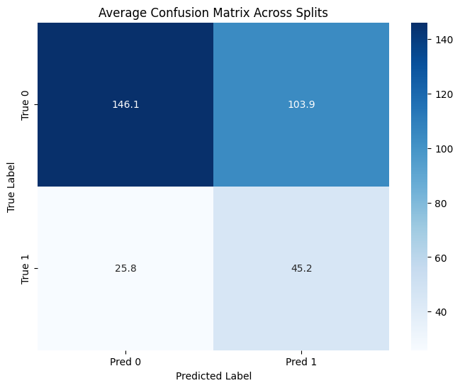

The weak predictive nature of the model is additionally exemplified by the precision and recall scores between the individual semantic and stylometric models that are part of the ensemble. F1 performance on the hold-out set for the semantic model was typically between 40% and 45%, whereas the stylometric model displayed much less predictive power between 30% and 35%. As a result the stylometric model was down weighted to have as little influence as possible. 

The best score on the hold-out set obtained on the official competition development set was 57.6%. This is far beyond what the training results show and suggests the competition development set has a higher proportion of positive classes than the training data.

<br />

#### Error Analysis

False positives were numerous as previously described in the Results section. These predictions are driven by the semantic encodings that are produced by the pre-trained encoder as the stylometric features were ultimately excluded given their lack of predictive signal. 

A major challenge with the semantic features is that the encoder models were often too powerful in terms of how small the training dataset is, and the resulting semantic nuance ends up representing the individual snippet instead of the general linguistic features. Without further processing of the features, the training performance of the model will be extremely high while performing significantly lower on the hold-out data indicating severe overfitting. 

To mitigate this and identify potentially useful features, a simple principal component analysis was performed to reduce the dimensionality of the features that may contribute noise or specificity of the snippet. Despite the transformation, the model still exhibited low confidence in many of its predictions that lead to the error rates previously described. 

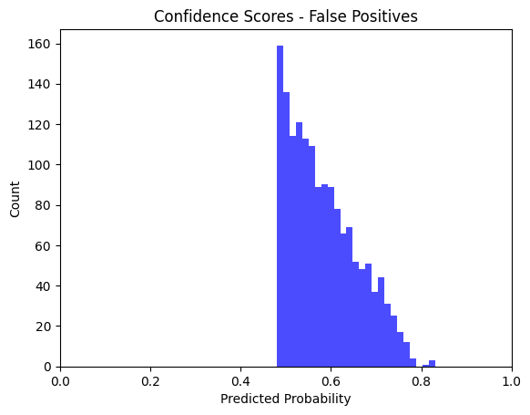

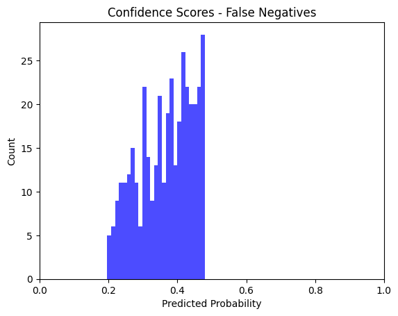

Examples of the true and false positives produced by the model were obtained to identify the broader shortcomings with training the entire model on the semantic features. Overall the false positive results display greater misclassification due to topic and style similarity, whereas the false negative examples are observed to occur among pairings where the text quality is poor or label noise exists.

More specifically, the false positive and false negative examples extracted for the analysis either fell into an error condition category of Topic Similarity, Stylistic Similarity, Label Noise, or Textual quality. Among the examples, the model made both confident and less certain predictions despite the overall confidence not being relatively ambiguous as observed in the prior histograms. The specific categories and their examples are as follows: 

<br />

- **Topic Similarity**: Many of the text pairs appeared to have a similar theming or context that is somewhat tangential to the other. For example one text may have a sci-fi theme while the other is more focused on fantasy. Since the two texts may leverage similar semantic nuance the model can confuse the texts as being from the same author. Oppositely, some text had completely opposite theming and hence vastly different semantic context that creates complicated edge cases for the model to learn.

An example of high topic similarity but non-matching authorship (i.e. false positive) can be found at index 95 with a probability of 0.578 produced by the model: 

> “Miro watched his futile strugglings mockingly. "Take these traitors over to the Gorm and let me look at their faces," he ordered. Grant and Nona were picked up in those emaciated, powerful arms as easily as though they were children, and the unhuman creatures proceeded at a slow, awkward pace away from the hall, toward the outer edge of the island. From his uncomfortable vantage point, Pemberton noticed that they were passing clumps of intricate stone machinery. [SNIPPET] “There’s no question about the results,” Harnosh was exulting. “ I’ll grant that the boy might have picked up some of that stuff telepathically from the carnate minds present here; even from the mind of Garnon, before he was discarnated. But he could not have picked up enough data, in that way, to make a connected and coherent communication. It takes a sensitive with a powerful mind of his own to practice telesthesia, and that boy’s almost an idiot.” He turned to Dallona. “ You asked a question, mentally, after Garnon was discarnate, and got an answer that could have been contained only in Garnon’s mind. I think it’s conclusive proof that the discarnate Garnon was fully conscious and communicating.” “Dirzed also asked a question, mentally, after the discarnation, and got an answer.”

An example of low topic similarity but matching authorship (i.e. false negative) can be found at index 433 with a probability of 0.311 produced by the model: 

> “Cortlandt tried to disconcert the enemy by raining duck-shot on its scale-protected eyes, while the two rifles tore off great masses of the horn that covered the enormously powerful legs. The men separated as they retreated, knowing that one slash of the great shears would cut their three bodies in halves if they were caught together. The monster had dropped the remains of the rhinoceros when attacked, and made for the hunters at its top speed, which was somewhat reduced by the loss of one leg. Before it came within cutting distance, however, another on the same side was gone, Ayrault having landed a bullet on a spot already stripped of armour….[SNIPPET] The breakwaters required to do this were built with cribbing of incorrodible metal, affixed to deeply driven metallic piles, and filled with stones along coasts where they were found in abundance or excess. This, while clearing many fields and improving them for cultivation, provided just the needed material; since irregular stones bind together firmly, and, while also insoluble, combine considerable bulk with weight….”

<br />

- **Stylistic Similarity**: Pairs of the text would occasionally appear to use very distinct similar language that creates a unique semantic context appearing to relate the snippets to one another and hence potentially the authorship. This was observed in an example with British English phrasing such as “thou hast”, “bewixt”, “favourite”, and “most worthy”. In other scenarios the model completely missed textual clues like strong language based on the surrounding context. This can include context framing such as generic dialogue leading to low semantic similarity despite being from the same author. 

An example of high stylistic similarity but non-matching authorship (i.e. false positive) can be found at index 463 with a probability of 0.771 produced by the model: 

> “Yet when he heard her begin to speak, it was in a steady voice that she said: “King’s Son, thou hast threatened me oft and unkindly, and now thou threatenest me again, and no less unkindly. But whatever were thy need herein before, now is there no more need; for my Mistress, of whom thou wert weary, is now grown weary of thee, and belike will not now reward me for drawing thy love to me, as once she would have done; to wit, before the coming of this stranger….[SNIPPET] Poor Eleanor! Poor Eleanor! I cannot say that with me John Bold was ever a favourite. I never thought him worthy of the wife he had won. But in her estimation he was most worthy. Hers was one of those feminine hearts which cling to a husband, not with idolatry, for worship can admit of no defect in its idol, but with the perfect tenacity of ivy.”

An example of low stylistic similarity but matching authorship (i.e. false negative) can be found at index 744 with a probability of 0.420 produced by the model: 

> Cutter snorted. “ Whatever the hell that damned gimmick does, it creates confidence, drive, strength, doesn't it? Isn't that what you said?” “Yes,” Bolen said politely. “ Approximately.” “Can you explain to me then, how ten percent more confidence in a man is saturation?” [45]Bolen studied what he was going to say carefully, smiling all the while. “ Some men,” he said very slowly, “are different than others, Mr. Cutter. [SNIPPET] "All right?" Loren said. Kirk glanced at the man, saw the wild, nearly vacant look of the face, the polite tilt of the head. Kirk's palms were wet. Goddamn it, he thought, and he stood up suddenly.

<br />

- **Label Noise**: Some of the text examples among the false positives and negatives had limited differences in terms of theming, language choice, and stylistic content. These examples observed low confidence scores from the model as a result of their ambiguous nature.

An example of label noise and non-matching authorship (i.e. false positive) can be found at index 291 with a probability of 0.645 produced by the model: 

> It had a big title splashed across it: OUR NEW TYRANT—THE COMPUTER. The article complained that some of the new labor and food regulations were the result of conscious reasoning on the part of The Computer. Devices to build the Computer bigger and bigger and bigger at the expense of ordinary workers. You know the sort of thing." "But it is true that the living standard is going down all the time, isn't it?" asked Mr. Tanter, keeping his ephemeral smile. " What about those three thousand starvation deaths up in Hydroburgh?" Krayton waved an impatient hand. " [SNIPPET] As the car rose, he reached out and turned on and adjusted the telescreen for the under-view. "Keep your eye on that, Father," he said. " That's what we're paying to get rid of." A distillery, bigger than the Menardes plant, long closed and now half roofless and crumbling. Rows of warehouses, empty after the War until taken over by homeless vagrants. Jerry-built shanties with rattletrap aircars grounded around them.

An example of label noise and matching authorship (i.e. false negative) can be found at index 748 with a probability of 0.399 produced by the model: 

> You can rest after we're away." The tall creatures entered a second compartment furnished with a large table upon which the silent machines deposited inanimate bodies. " Extraordinary!" said Eo, staring at Miss Betsy Tapp. " These things have reached a peak of mammalian development!" [SNIPPET] "You're fired," the man in the dream said over and over. Calvin C. Kear rolled off the half-bed, struck the floor, and awoke. " First time I've fallen out of bed in years," he groaned. His shaking hand fumbled with the switch and succeeded in turning on the lamp.

<br />

- **Textual Quality**: Many of the text pairs in the dataset are of low fidelity including issues such as out of context snippets, non-descript language, and brief text. The result of these being paired with longer, more contextually rich snippets creates extremely challenging edge cases for the model to classify between. 

An example of label noise and non-matching authorship (i.e. false positive) can be found at index 1450 with a probability of 0.597 produced by the model: 

> “I got up from my park-bench to walk with her, hand-in-hand, to the dining room, stopping en route at my room for a shirt. Dinner was a formal affair in the Big Tank, shirts for the gentlemen and shoes for all. The other Lapins were already eating. They greeted me and especially the Firebird with jokes and fellowshippy sounds. I felt very much at home with them. There was Bud Dorsey, our weight-lifting astrophysicist, his magnificent u.v.-blackened body a study in the surface musculature of the human male. At his table was Karl Fyrmeister, who has a practically complete collection of the airmail stamps of the world to console him on long winter evenings. All the stamps are quite sterile. [SNIPPET] Ives rose from the couch and came forward to stand beside Paresi. Johnny was manipulating the keys firmly. His fingers began to play a rapid, skillful, silent concerto. His face had a look of intense concentration and of complete self-confidence. "Well," said Ives heavily. " That's a bust, too."”

An example of label noise and matching authorship (i.e. false negative) can be found at index 352 with a probability of 0.271 produced by the model: 

> “Her tears dropped more freely. " Sooner or later I knew they'd get him. The only child in town. And now I have nothing to do. [SNIPPET] "By God, Staghorn," Peccary thundered, "you've doctored it! You've deliberately fed false information into Humanac's memory cells!" Staghorn turned to glare at his guest, his eyes flaming at the outrageous suggestion. " The only hypothetical element I've fed into Humanac is your Y Hormone, Dr. Peccary! You saw me do it. You watched me check the computer before we started." "I refuse to believe that my Y Hormone will bring about the consequences that machine is predicting!””

<br />

#### Reproducibility

To reproduce the results of the competition there are two methods that can be used. Any modern device with over 8GB of RAM could theoretically run the model given the size of the dataset. However, it is recommended that additional computing resources be available if needed.

The first method is to build the Docker image of the repo which offers the most stable reproducibility. Please first clone and mount the repo, then execute the build command. To execute the dummy file that ensures all aspects of the repo are working correctly please use the “docker run” command listed below and in the repo readme file. Otherwise, a fully working notebook exists that can be interacted with to recreate the results. 

```
git clone https://github.com/githubuser/repo-name.git

cd repo-name

docker build -t hybridStylo

docker run hybridStylo
```

As an alternative, the contents of the working notebook can successfully be run in a Google Colab environment for free resources on very low compute devices. First the user's personal drive and folder location for the repo will be mounted to the notebook. Next the repo can be cloned through a personal access token generated on the user's Github account. Finally the repo is mounted to the notebook and the same contents can be run in the environment. 

```
from google.colab import drive
drive.mount('/content/drive')

%cd /content/drive/MyDrive/LING 582/Class Competition/

token = "tokenhere"
repo_url = f"https://{token}@github.com/uazhlt-ms-program/ling-582-fall-2025-class-competition-code-edjpman.git"

!git clone $repo_url
%cd ling-582-fall-2025-class-competition-code-edjpman
```

<br />


#### Leaderboard Result

The leaderboard position of my post can be found under the alias “Ethan Parks” with a current best score on the development set of 57.6% which exceeds the weighted random baseline of 50.3%. This is an improvement on the results obtained during the model training and likely indicates more positive class examples existing in the official competition development set.


<br />


#### Citations

Fabien, M., Villatoro-Tello, E., Motlicek, P., & Parida, S. (2020, December). BertAA: BERT fine-tuning for authorship attribution. In P. Bhattacharyya, D. M. Sharma, & R. Sangal (Eds.), Proceedings of the 17th International Conference on Natural Language Processing (ICON) (pp. 127–137). NLP Association of India (NLPAI). https://aclanthology.org/2020.icon-main.16/

Song, K., Tan, X., Qin, T., Lu, J., & Liu, T.-Y. (2020). MPNet: Masked and permuted pre-training for language understanding. arXiv. https://arxiv.org/abs/2004.09297


