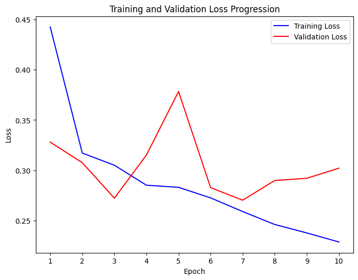
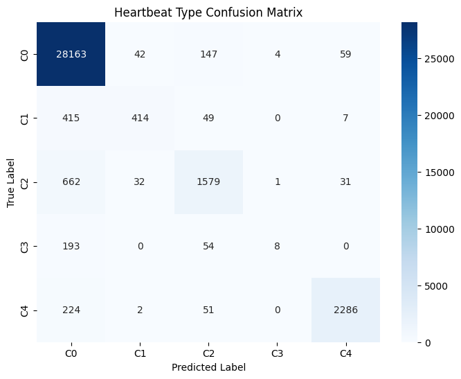
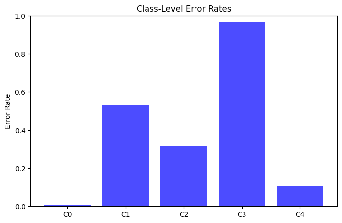
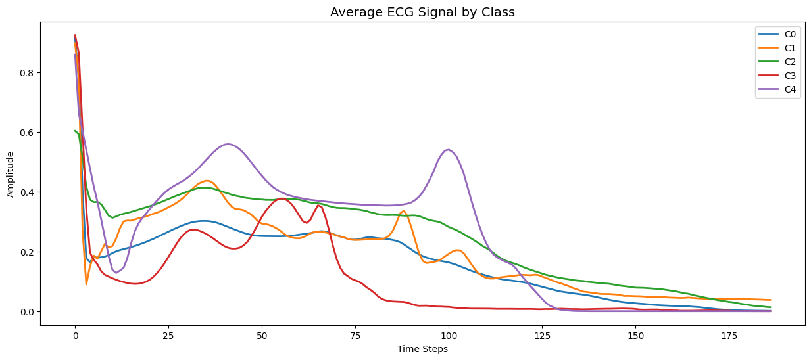
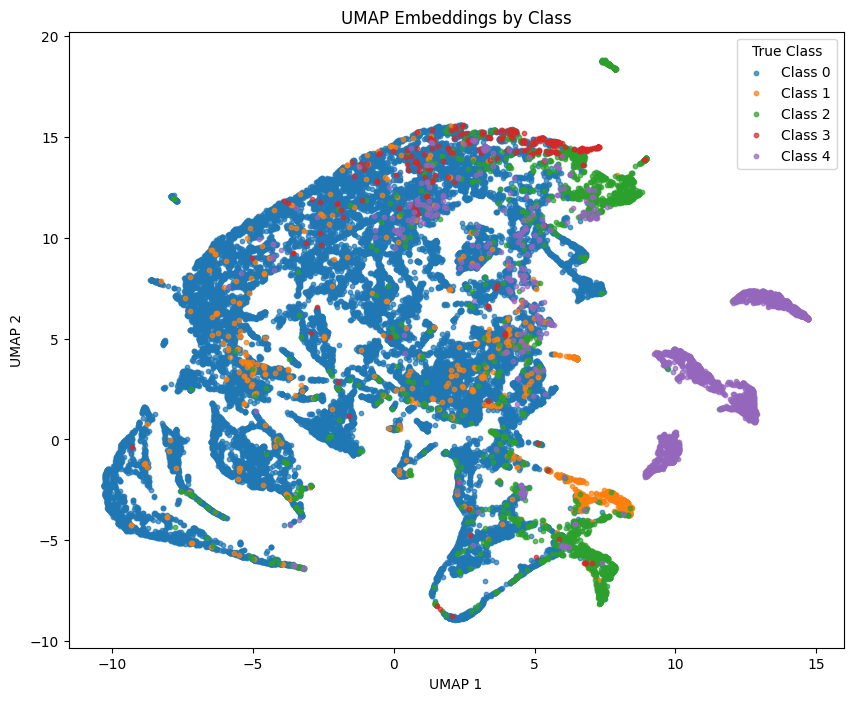
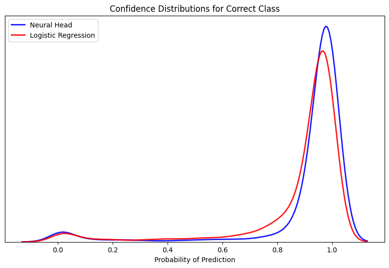
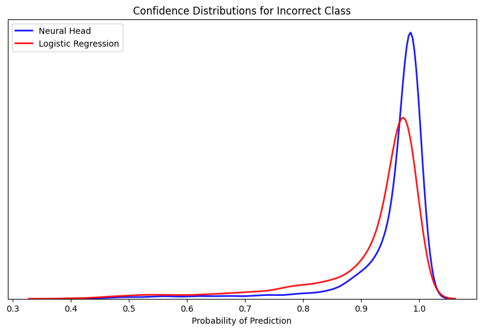

<table>
  <caption>
    Course Project Info
  </caption>
<tbody>
  <tr>
    <th>Code Repository URL</th>
    <td>https://github.com/uazhlt-ms-program/ling-582-fall-2025-course-project-code-sesame-street-neural-linguists.git</td>
  </tr>
  <tr>
    <th>Team name</th>
    <td>Sesame Street Neural Linguists</td>
  </tr>
</tbody>
</table>


## Summary of individual contributions
<table>
  <thead>
  <tr>
    <th>Team member</th>
    <th>Role/contributions</th>
  </tr>
  </thead>
<tbody>
  <tr>
    <th><b>Ethan Parks</b></th>
    <td>Author/Owner</td>
  </tr>
</tbody>
</table>


## Geometric Sequence Transformers

<br />
<br />

#### Project Overview


##### Modeling Architecture

In this experiment, statistical natural language processing methodologies were modified for their application outside of text based tasks. More specifically a lightweight approach was proposed in which time series data is tokenized into local “geometric” embeddings of a broader context window. The application of the model is applied to an arrhythmia dataset in which heartbeats are classified based on their structure.

Architectural design choices of the model loosely follow that of other pre-trained transformer architectures such as that of BERT (Devlin et al. 2018), with modifications for novel inclusions to boost the performance of model and process data that may have less inherent semantic information than text. A fully “geometric” variation of the model is proposed for a later capstone project in which data inputs are tokenized into larger sparse matrices. This version was not implemented due to time constraints of the course.

In the first stage of the process the model takes inspiration from the tokenization of text as learnable vectors that are passed through an encoder. Framing a time series like a sequence of words, the tokenization process begins by capturing the local structure into local context windows of a single heartbeat sequence. Each of the local context windows are then initialized into their embedding form by passing through a dense layer and being formed into batches of BxLxD; B individual heartbeat context windows, L local context windows, and D dimensions of the embeddings. 

Given that transformer encoders do not inherently know sequential relationships, models such as BERT have shown that learnable position vectors significantly improve the models ability to understand relationships across embeddings. The same process is followed for the geometric transformer in which a learnable position embeddings of a shape 1xLxD are elementwise added to the local context embeddings for each heartbeat in the batch. 

The resulting positionally aware embeddings pass through a small vanilla transformer encoder in which the outputs of shape BxLxD are converted to BxD by obtaining a single vector representation through a variant of mean pooling across all local context embeddings for each heartbeat. 

Batches of the heartbeat vector embeddings are finally passed through a feed-forward classifier head that is tasked with predicting the class of the heartbeat. During the training cycle the data is structured into different training shuffles to measure robustness across different regimes. In a single shuffle the weights of the encoder are left unfrozen to allow for the error to be propagated through the architecture to tune the different context and positional embeddings. Once an optimal model loss is achieved in the shuffle, the weights of the model are frozen and the generalization performance measured on the hold-out validation set. 


##### Novelty and Motivations

The deep learning based architectures and data processing steps for NLP tasks are extremely powerful and have shown great successes outside of the domain of language. A key motivation for this project is to better understand how these models can represent data in novel ways through their own learning processes to expand the downstream applications and model capabilities. A “geometric” framing to the data is one of these areas.

Previous to the transformer architecture, approaches to similar tasks included the use of standard feed forward and convolutional networks. These approaches produced world class results based on their ability to identify meaningful patterns among extremely complex datasets and quickly became a growing area of research. 

One of the most common approaches to modeling medical sequential data is through computer vision tasks backed by deep convolutional networks. In the medical field these models have shown adoption in the areas of radiology imaging data and patient vitals monitoring given their ability to augment the image analysis tasks that were previously performed by doctors, radiologists, and nurses. 

Despite the success, the convolutional networks for human vitals data is largely reliant on learning aspects of pixel formation on an image that requires many dense representations of the image which is not only computationally intensive but can miss unique subtleties to the sequence during the creation of the latent features. 

Representing the sequence as a geometric embedding to be used in a transformer architecture improves many of the aforementioned challenges. Instead of requiring numerous high quality image representations of each tiny fluctuation of the sequence, the transformer architecture directly leverages the geometry with its relation to others in a sequence to identify both local and global structure in a more nuanced manner. 

This alternative approach represents a novel take on how geometric structure is typically modeled using deep learning based approaches. The approach has the potential to produce similarly strong performance while being practically flexible to scenarios that require longer training context windows, implementations where images are not possible to be captured in an efficient manner, and where general learned representations may be important as a foundation for domain specific tasks. 


##### Related Works

The ability of data to generally be represented as matrices and vectors has expanded the use of deep learning frameworks to their use in numerous scenarios and domains. With the rise of transformers in 2017 (Vaswani et al. 2017), the applications outside of sequence based text processing has steadily grown given the model’s ability to leverage a statistical mechanism of “attention”. The latent states of contextualized textual representations created by transformers are believed to be extremely beneficial in providing a more detailed way of modeling patterns across a wide range of tasks. This is especially the case in the field of medicine which the course project Geometric Transformer is designed for.

As previously mentioned many of the current SotA methods in the medical field for geometric interpretation are achieved through convolutional networks. Medical imaging has been a common starting point for this type of modeling often being deployed for anomaly detection in CT scans and MRIs. For example, Litjens et al. (2017) and Mienye et al. (2025) provide meta analyses that highlight the effectiveness of convolutional deep learning methods in achieving SotA performance in oncological imaging frameworks for cancer detection. 

On similar data as this project, deep learning architectures have achieved better results than human experts in the field for arrhythmia detection and classification. In a 2019 study, Hannun et al. proposed convolutional style deep neural networks to classify 12 heartbeat rhythm categories achieving a mean F1 score of 83.7% as compared to a mean F1 of 78.0% by human cardiologists. Other approaches such as that by Jeon et al. (2020) include deep sequential models like recurrent networks, achieving a classification accuracy of ECG heartbeats of 99.8%. Other approaches such as the fusion of convolutional networks and transformers (Che et al., 2021) observed above 80% classification accuracy compared to much lower performance among base convolutional and recurrent networks on ECG signal. 

The use of transformers in the medical specific domain have not been widely explored for sequential modeling purposes and largely focused on language based tasks that the models were originally constructed for. These include the summarization of clinical notes, the extraction of information from electronic health records, and the generation of patient reports. In a review by Nerella et al. (2024) evidence was presented that training bidirectional encoders has substantially reduced the effort clinicians have to spend on generating high quality summaries of documentation. Furthermore, a 2024 study by Van Veen et al. involved ten physicians evaluating the effectiveness of LLMs in summarizing documentation on radiology reports, patient questions, progress notes, and doctor-patient dialogue. In nearly a third of the cases the LLM outperformed the quality of human generated summaries (36%) and in half the cases (45%) the LLM generated equivalent quality summaries as the humans. 


##### Task Challenges

As with traditional language tasks, the application of neural based language models to outside domains present distinct and significant challenges. Not only is the data completely different from text, but the underlying assumptions of the data may significantly stray from what is inherent to a language domain, and hence complicates the process. 

In terms of the project model, an initial challenge that exists from the geometric perspective is the minor subtlety of the heartbeat differences. Despite heartbeats being a relatively consistent sequential trend, the individual aspects of the beat may vary so slightly that the model does not capture its full significance. For example, a slight change in a single value of a local sequence may have a distinct meaning but not be emphasized given the other steps within the local window; [0.3 0.2 **0.1** 0.7 0.9] as compared to [0.3 0.2 **0.5** 0.7 0.9].

This differs from text, in the sense that text tokens are processed individually and contextually through semi-supervised learning processes that capture numerous different use cases. Oppositely the geometric interpretation involves tokens that are localized windows focused on the broader representation across numerous steps. 

Another major challenge is the domain shift away from data that has distinct semantic meaning to each step. Text within a sequence has unique rules and a distinct semantic meaning for each individual step based on its surrounding context. The same can not necessarily be said for a general time series, or at least not to the same degree. As a result, the power of the transformer to include this semantic meaning into an embedding may be dampened for non textual uses. 

For example, the word “bolted” in the sentence “The chicken bolted across the road” is inherently influential to the entirety of the sequence and forms distinct semantic relationships to the structure of the sequence that would not exist if the word was not there otherwise. A local geometric embedding sequence of [0.5 **0.2** 0.9] in a larger context of a series, versus a similar embedding of [0.5 **0.4** 0.9] at the same position holds a much more ambiguous relational aspect to the embeddings in the larger context. Slight changes in the embedding may represent geometric sequence noise or some significant pattern.

Finally, leveraging statistical language concepts such as the attention mechanisms within transformer architectures assume an ample amount of data to exist for proper training. One benefit to modeling language in the internet age is the availability of well structured and accessible raw data. Neural methods to model aspects such as semantic nuance were seemingly designed with this in mind, as they generally improve their representations with larger and more diverse corpuses they are trained on (Kaplan et al., 2020). 

In the context of general sequential data, the same availability of large volumes of generalized examples rarely exists. This is a particularly challenging problem given that sequential data is also often domain specific and not easily generalizable. Recent advances in non-text transformer based approaches have shown promising results for leveraging a language model style of pre-training for transfer of general sequential patterns to different domains (Nie et al., 2023).


##### Task Specific SotA Approaches

As previously mentioned, there has been substantial momentum to adopt neural language architectures for alternative domain applications. To focus the scope, SotA approaches will be discussed in relation to the dataset that was selected for this project. The dataset specifically is hosted on Kaggle and sourced from the MIT-BIH Arrhythmia Database for heartbeat classification. This provides a realistic application of the language architecture to non-text domains of sequential data that has a large number of attempted approaches. 

The various architectures applied to the sequential data have largely shown a variety of neural approaches can provide strong results with relatively high F1 classification scores. Interestingly, hybrid approaches tended to be the most successful in achieving world class performance. Model types drew from approaches that are typically utilized for sequential data while others did not, highlighting the opportunity of neural methods to be used as general computational frameworks. 

Two specific approaches have garnered the most attention as obtaining SotA results. The first by Kachuee et al. (2018), implements a computer vision approach to interpreting the sequential data points. This involved multiple stacked convolutional layers with pooled outputs followed by a final set of connected layers and a softmax output. The results after being trained on over 4,000 different examples produced an average accuracy score of 93.4%.

Another approach with significant attention was published by a Kaggle user (Polo, 2021) who achieved a similar macro-F1 score over 97% for three different model styles tested. The author loosely built upon that of Kachuee et al. with both a vanilla computer vision and two hybrid approaches. For each of the models, the same framing of the sequential data as a vision task was taken followed by stacked convolutional layers with pooling outputs. However, the three models in the authors' submission differed by their downstream handling of the data.

The first model solely implemented a single fully connected classification head, whereas the second approach blended a bidirectional LSTM plus a fully connected classifier, and the third approach an LSTM with an attention mechanism and a fully connected classifier. Despite the increasing complexity in the models, the resulting macro-F1 scores for each hardly differed.

Although both SotA approaches framed the sequential task from a vision perspective, the ability of language models such as transformers were not often included in other near-SotA architectures. The reasoning behind this trend may be a result of the challenges associated with ensuring a transformer properly represents an ordered sequence of non-text inputs. This however does not take away from the potential statistical language processes may have, especially given their success in representing sequences of text.

<br />

#### Summary of Individual Contribution

The efforts made in this implementation are solely made by myself, Ethan Parks. This includes the ideation of the project, the software development, and the subsequent analysis. The project serves as an initial proof of concept for a larger capstone effort. The components completed as the sole contributor are summarized below:

- ***Conceptual Design***: A transformer style sequence modeling architecture was adapted for a non-text downstream task of classifying heartbeat sequences for arrhythmia patterns. 

- ***Implementation***: A custom “tokenization” process of geometric like structure was developed for the architecture to implement a full training process of the transformer encoder. 

- ***Evaluation***: Designed a complete analysis of the error through a holdout of the false-positives and false-negatives along with a cluster analysis of the embeddings to ensure meaningful geometric interpretations were developed.

- ***Documentation***: A clean and modular code repository was constructed along with simple instructions to replicate the results and run new experiments with the model. 

<br />

#### Proposal for Future Improvements

##### Design Limitations and Enhancements

The architecture designed for the process takes a novel approach to leveraging statistical language processes by representing “geometric” interpretations of sequential data as embeddings. While the approach has the potential for improvements in how sequential data can be represented, the time constraints of the course significantly reduce the current capacity of the process. 

In a more complete version two specific aspects can be expanded to improve the data processing and the application of architecture. First, the geometric interpretation of the embeddings can become more concrete than simply a stride across a sequence. This was a basic implementation due to time constraints but could be enhanced by representing the sequence of embeddings through a sparse matrix representation of the trend shapes. These individual shapes can then be tokenized and given “semantic” meaning by their probabilistic occurrence together within a larger context window. 

Another critical addition to improve the application of the geometric representation is a fusion process with other embedding types. While the geometric embeddings may be predictive in a sequence they likely do not capture all nuances of the series. A second parallel encoder could be added that creates embeddings for alternative measures such as context windows of scale, magnitude, and distance among others that can then be fused with the geometric embeddings to create more sequentially nuanced representations of the data. 


##### Alternative Considerations

As highlighted in the SotA approach discussion, aspects of statistical language modeling are often less frequently applied to non-text sequential domains despite natively working with data where order and position matter. More sophisticated tokenization methods that include aspects beyond the simple geometric shape and position such as deeper layered embeddings used for models like BERT may improve the ability to represent a time series in a more nuanced manner with respect to the broader context.

Additionally, modifications to the transformer block such as switching from a vanilla encoder to a bidirectional encoder may allow the model to obtain new representations of the series patterns that improve the generalizability and accuracy for downstream tasks, as has been the case for neural based language modeling tasks.

Finally, recent papers have highlighted the ability of modifying a language modeling like pre-training processes for use of general time series features across different domains (Nie et al., 2023). The modeling process of this project is currently focused on a simple supervised learning training implementation rather than a full pre-training and domain fine-tuning cycle. The addition of a pre-training and fine-tuning process on a variety of heartbeat vitals may allow for a more robust task transfer to detecting the arrhythmia classes. This is especially important if the events are rare in nature creating an imbalanced dataset and limited examples to draw distinct patterns from.

<br />

#### Results 

After a final complete training and tuning cycle the model identified general patterns of the ECG heartbeats moderately well achieving a mean F1, precision, and recall of 66.2%, 84.2%, and 61.3% respectively. A bootstrapped confidence interval was obtained for the F1 score of the lower and upper bounds at the 95% confidence level of 65.2% and 67.3%. Only a single training regime (shuffle) was performed for the model given the limited compute resources and the multiple hours required to complete a single shuffle. 

The tuning of the model occurred over three different stages. The initial run of the model included an architecture with less expressive power over only 6 epochs. The specific parameters included a small batch size of 8, a model dimensionality of 5, and a relatively high learning rate of 1e-3. This run produced a consistent decrease in training loss over each epoch finishing with a final F1 score of 68.4%. 

The expressive power of the model was then increased with a model dimensionality of 128 and the same learning rate, and run over a 20 epoch cycle. By the 10th epoch in the cycle it became clear that the learning rate of the model was too high as the validation loss stopped decreasing early in the cycle with the model bouncing around different local minimums in the loss space instead of smoothly converging on a more well defined minimum.



To mitigate this, the loss rate was decreased to 1e-4 and the epochs set to three. The result of this run produced the comparable outcome results as the 6 epoch run with an F1 score of 66.2%, precision of 84.2%, and recall of 61.3%.
 
Looking deeper into each of the classes, the proportions of each represented in the hold-out set are extremely imbalanced with the majority originating from the Class-0. Despite the heavy imbalance, the model appeared to correctly predict the true label a majority of times in three of the five classes. Those however with the most extreme imbalance such as Class-3 observed the poorest classification performance with approximately 40% of the examples incorrectly classified.



<br />

#### Error Analysis

Given there are over 30,000 different examples of heartbeats each with their own geometric subtleties, individually reviewing the beats from the held out development set is challenging for determining the exact reasoning behind the error produced by the model. Instead a class based analysis is more effective for contrasting areas the model struggled in versus those it performed well on. Future work can include attention mapping to the sequences for the regions the model places the highest weight on. 

By nature the training dataset is imbalanced with most heartbeats attributed to the normal category in Class 0 (N=142,075; 82.5%). The arrhythmic beats of Classes 1-4 comprise 2.6%, 6.7%, 0.7%, and 7.4% of the training dataset respectively. Across the dataset, the highest rates of error produced exist in the sparse classes with Class-3 observing a 96.9% error rate as compared to the most common class (Class-0) with an error rate of 0.9%. 



The small number of instances limit the model’s ability to capture the distinct geometric features of the sequence that are used to assign a high degree of confidence to the particular class. Looking at the mean values of the poorly captured sequences and contrasting with the well performing classes accentuates the distinct areas the model may be struggling to capture. 

Specifically among the worst performing classes (i.e. Class 1 and 3), the heartbeats form much more distinct shapes than the others. This includes Class 1 experiencing a higher level of variation in the beat that without enough examples may appear more similar to Class 0 or Class 2. Oppositely Class 3 appears to be the most distinct among the five heartbeat types with amplitude peaks during times in the sequence that no other beats have. Despite the distinct structure the class observed the lowest performance which is likely a result of its extreme sparsity compared to the other classes.



The performance of the model on the more sparse classes is supported by the less clear separability highlighted in the non-linear dimensionality reduction analysis. The majority class of normal heartbeats (Class 0) display a larger coherent formation as opposed to the sparse classes which have examples that are scattered among other clusters. 

The spread of some minority class examples among the larger majority class indicate some variation in the geometric nuances that the transformer is failing to concretely model. For example, the geometric nuances of the minority Class 1 embeddings may be relatively similar to that of Class 0 and Class 2 as previously noted, indicating the model is missing the unique geometric features that are important for separability among all classes. 



A final analysis of the error confirms the strength of the learned heartbeat embeddings using a simple logistic regression as a probe to determine the arrhythmia classes linear separability. Given the model was able to strongly classify three of the five types that account for the majority of the examples, the model observed producing a high degree of confidence for the true labels within the hold-out set. 

Alternatively, when assessing the cases where the model selected the wrong prediction to the true label it did so in a very confident manner. This confirms many of the separability issues of the minority classes that were previously observed as the model is finding very little signal to refute the prediction given the lack of ambiguity in the confidence score. 





<br />

#### Reproducibility

To reproduce the results of the competition there are two methods that can be used. A modern device with over 16GB of RAM is necessary to train the model on the entire dataset of nearly 200,000 heartbeats.

The first method is to build the Docker image which encapsulates all dependencies, ensuring the most stable reproducibility. Please first clone and mount the repo, then execute the Docker build command. 

```
git clone https://github.com/githubuser/repo-name.git

cd repo-name

docker build -t geomtransformer .
```

To test if the entire file and its components are working properly, first open an internal shell and execute the following commands for the “dummy_run” file. Please note, if the run fails try one more time as the random assignment of target features may have produced too few for a certain category. 

```
docker run -it geomtransformer:latest /bin/bash

python -m src.test.dummy_run

exit #To exit the internal shell
```

To produce the exact results that are highlighted in the project description, open the contents of the repo in a local or cloud based IDE and navigate to the “02_modeling.ipynb” notebook. Each cell can be executed in chronological order to obtain the same performance. Please note that **exact-matching** predictions and training results may not occur due to the randomness in how the training and testing data is shuffled.

As an alternative, the contents of the working notebook can successfully be run in a Google Colab environment for free resources across very low compute devices. First the user's personal drive and folder location for the repo will be mounted to the notebook. 

```
from google.colab import drive
drive.mount('/content/drive')

%cd /content/drive/MyDrive/LING 582/Class Project/
```

Next the repo can be cloned through a personal access token generated on the user's Github account. 

```
token = "tokenhere"

repo_url = f"https://{token}@github.com/uazhlt-ms-program/ling-582-fall-2025-class-project-code-edjpman.git"
```

Finally the repo is mounted to the notebook and the same contents can be run in the environment. Please note that periodic memory clearing may be necessary to run using the Colab CPU to not exceed memory limits.

```
!git clone $repo_url

%cd ling-582-fall-2025-class-project-code-edjpman
```

<br />

#### Code Repository

The repository containing the code for this project can be found at https://github.com/uazhlt-ms-program/ling-582-fall-2025-course-project-code-sesame-street-neural-linguists once the course is complete, the code will be migrated over to a new repository at https://github.com/edjpman. The repository will additionally include all the examples and instructions to recreate the results achieved.

<br />

#### Additional Citations

Che, C., Zhang, P., Zhu, M., Qu, Y., & Jin, B. (2021). Constrained transformer network for ECG signal processing and arrhythmia classification. BMC medical informatics and decision making, 21(1), 184. https://doi.org/10.1186/s12911-021-01546-2

Devlin, J., Chang, M.-W., Lee, K., & Toutanova, K. (2019). BERT: Pre-training of deep bidirectional transformers for language understanding. arXiv. https://arxiv.org/abs/1810.04805

Hannun, A. Y., Rajpurkar, P., Haghpanahi, M., Tison, G. H., Bourn, C., Turakhia, M. P., & Ng, A. Y. (2019). Cardiologist-level arrhythmia detection and classification in ambulatory electrocardiograms using a deep neural network. Nature medicine, 25(1), 65–69. https://doi.org/10.1038/s41591-018-0268-3

Jeon, E., Oh, K., Kwon, S., Son, H., Yun, Y., Jung, E. S., & Kim, M. S. (2020). A Lightweight Deep Learning Model for Fast Electrocardiographic Beats Classification With a Wearable Cardiac Monitor: Development and Validation Study. JMIR medical informatics, 8(3), e17037. https://doi.org/10.2196/17037

Kachuee, M., Fazeli, S., & Sarrafzadeh, M. (2018, June). ECG heartbeat classification: A deep transferable representation. In 2018 IEEE International Conference on Healthcare Informatics (ICHI) (pp. 443–444). IEEE. https://doi.org/10.1109/ichi.2018.00092

Kaplan, J., McCandlish, S., Henighan, T., Brown, T. B., Chess, B., Child, R., Gray, S., Radford, A., Wu, J., & Amodei, D. (2020). Scaling laws for neural language models. arXiv. https://arxiv.org/abs/2001.08361

Litjens, G., Kooi, T., Bejnordi, B. E., Setio, A. A. A., Ciompi, F., Ghafoorian, M., van der Laak, J. A. W. M., van Ginneken, B., & Sánchez, C. I. (2017). A survey on deep learning in medical image analysis. Medical Image Analysis, 42, 60–88. https://doi.org/10.1016/j.media.2017.07.005

Mienye, I. D., Swart, T. G., Obaido, G., Jordan, M., & Ilono, P. (2025). Deep Convolutional Neural Networks in Medical Image Analysis: A Review. Information, 16(3), 195. https://doi.org/10.3390/info16030195

Nerella, S., Bandyopadhyay, S., Zhang, J., Contreras, M., Siegel, S., Bumin, A., Silva, B., Sena, J., Shickel, B., Bihorac, A., Khezeli, K., & Rashidi, P. (2024). Transformers and large language models in healthcare: A review. Artificial intelligence in medicine, 154, 102900. https://doi.org/10.1016/j.artmed.2024.102900

Nie, Y., Nguyen, N. H., Sinthong, P., & Kalagnanam, J. (2023). A Time Series is Worth 64 Words: Long-term Forecasting with Transformers. arXiv. https://arxiv.org/abs/2211.14730

Polo, M. (2021, February 26). ECG classification | CNN LSTM attention mechanism [Kaggle notebook]. Kaggle. https://www.kaggle.com/code/polomarco/ecg-classification-cnn-lstm-attention-mechanism

Van Veen, D., Van Uden, C., Blankemeier, L., Delbrouck, J.-B., Aali, A., Bluethgen, C., Pareek, A., Polacin, M., Reis, E. P., Seehofnerová, A., Rohatgi, N., Hosamani, P., Collins, W., Ahuja, N., Langlotz, C. P., Hom, J., Gatidis, S., & Pauly, J., & Chaudhari, A. S. (2024). Adapted large language models can outperform medical experts in clinical text summarization. Nature Medicine, 30(4), 1134–1142. https://doi.org/10.1038/s41591-024-02855-5

Vaswani, A., Shazeer, N., Parmar, N., Uszkoreit, J., Jones, L., Gomez, A. N., Kaiser, Ł., & Polosukhin, I. (2023). Attention is all you need. arXiv. https://arxiv.org/abs/1706.03762
