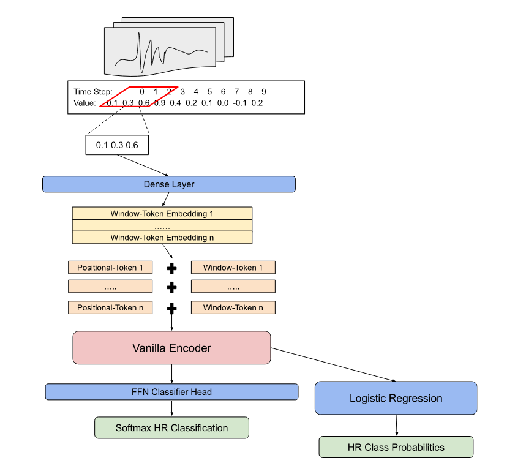

<table>
  <caption>
    Course Project Info
  </caption>
<tbody>
  <tr>
    <th>Code Repository URL</th>
    <td>https://github.com/uazhlt-ms-program/ling-582-fall-2025-course-project-code-sesame-street-neural-linguists.git</td>
  </tr>
  <tr>
    <th>Team name</th>
    <td>Sesame Street Neural Linguists</td>
  </tr>
</tbody>
</table>

## Summary of individual contributions
<table>
  <thead>
  <tr>
    <th>Team member</th>
    <th>Role/contributions</th>
  </tr>
  </thead>
<tbody>
  <tr>
    <th><b>Ethan Parks</b></th>
    <td>Author/Owner</td>
  </tr>
</tbody>
</table>

## Mid-Semester Project Goals/Description

### Statistical Concepts and Motivations

Some of the most impactful breakthroughs in statistical natural language processing over the past 15 years include the ability to represent words as numerical vectors and infuse semantic nuance into the vector representation through a transformer architecture. These algorithms have proven extremely effective in linguistic contexts given the inherent structural relationships to language. 

Tokenization to vectors and semantic encoding can however be very general. A current area of research and the focus of this project is to explore these aspects of statistical natural language processing in determining whether the methods can make meaning from non-textual sequential data.

Generalizability of these properties to outside contexts have been a fascination of mine, and the focus of a more extensive capstone project that I plan to complete. To introduce the potential for this capstone, a light experiment of applying the statistical language properties will be performed on an ECG heart beat classification task. 

### Model Application

The modeling architecture for this project first takes a fixed length window around the individual ECG heartbeat intervals to capture the full sequence of the beat. Next a context window slides across the sequence at a particular stride to capture local relationships as individual “tokens”. This process is similar to that of transformer encoders using a fixed length sequence of tokens to use in determining textual relationships.

The local context for each part of the heartbeat windows is projected onto a higher dimensional space through the use of a dense layer to create BxLxD vector embeddings of B-heartbeat batches, L-local context windows, and D-feature dimensions. The local context embeddings are then added elementwise to learnable positional embeddings. Positionally aware embeddings are necessary for transformer encoders to determine relationships in an order dependent nature as is often the case in language.

The positionally aware ECG embeddings per heartbeat are then passed through a vanilla encoder block in mini batches to obtain a contextually aware representation of the local ECG embeddings. These embeddings use the pooled version of the final encoder layer to represent the latent representation of each heartbeat with a final shape of Bx1xD. The weights of the transformer block will remain unfrozen during training to allow for updates to be made to the weights during the process. 

To modify the weights of the full encoder and tokenization phase a feed forward head will be tasked with predicting the class of the heartbeat. Once optimal performance is achieved with the classification head, the weights of the encoder are frozen for additional testing. This is designed to mimic the pre-training process of a language model and identify general sequential patterns. Finally a logistic regression classifier produces output probabilities for each of the heartbeat classes. The performance of the model is a test of how linearly separable the pooled embeddings of each heartbeat are, showing the attentive power of the language encoder to non-language tasks. A visual representation of the architecture is shown below.

### Timeline/Scoping

The approximate timeline for the various sections of the projects are detailed below. The architectural and testing designs strongly considered the course timeframe to ensure that the scoping is appropriate. Choices of models, tokenization, and data manipulation will rarely employ custom methods but rather vanilla implementations of pre-built functions from trusted libraries such as Sklearn, Pytorch, Numpy, and Pandas, among others. 

The dataset for this project is readily available on Kaggle and will only be processed to create an initial dataset of fixed heart rate windows and their respective classes. All other additions will follow a lightweight implementation to ensure a working model pipeline and showcase the potential of language modeling techniques to be applied to other sequential tasks.

 
** Week 1 [10/19-10/25]: **
- Description: Determine project idea and detailed plan of each component. 
- Status: COMPLETE
** Week 2 [10/26-11/1]: **
- Description: Work of the Draft Submission and start the structural code.
- Status: COMPLETE
** Week 3 [11/2-11/8]: **
- Description: Finalize code with a dummy run and Draft Submission. 
- Status: COMPLETE
** Week 4 [11/9-11/15]: **
- Description: Work on the testing/tuning of the model.
- Status: ON TRACK
** Week 5 [11/16-11/22]: **
- Description: Finalization of the tests, results gathering, and Final Draft outline creation. 
- Status: ON TRACK
** Week 6 [11/23-11/29]: **
- Description: Work on Final Draft and containerization.
- Status: ON TRACK
** Week 7 [11/30-12/6]: **
- Description: Completion of Final Draft.
- Status: ON TRACK

