<table>
  <caption>
    Course Project Info
  </caption>
<tbody>
  <tr>
    <th>Code Repository URL</th>
    <td>https://github.com/uazhlt-ms-program/ling-582-fall-2025-course-project-code-indigenous-language-ocr</td>
  </tr>
  <tr>
    <th>Demo URL (optional)</th>
    <td></td>
  </tr>
  <tr>
    <th>Team name</th>
    <td>Indigenous Language OCR</td>
  </tr>
</tbody>
</table>

## Project description

_See [the rubric](https://parsertongue.org/courses/snlp-2/assignments/rubrics/course-project/final/#reproducibility).  Use subsections to organize components of the description._
### Overview

For this project, I am trying to perform Optical Character Recognition on typed resources (old and typewritten documents) in Coeur d’Alene (CdA). The documents are written in a manner similar to the Reichard Orthography, a phonetic transcription of the CdA language. However, for the sake of this project, I will treat it as an orthography for a language, compared to something like the IPA.

The document’s nature includes bad fax copy lines, blurred text, handwritten notes, and typewriter-written text with flaws and inconsistencies.
For this project, I’ve decided to use TrOCR, which is a transformer-based OCR model.

My reason for choosing this project is because it is also my HLT internship. As a linguist, I've always been fascinated by languages, especially indigenous languages. While I knew nothing about OCR before starting this, I've learned plenty. My main obstacle is there is very little resources or code demos about training on languages with special tokens like mine.

### 💻 Choosing the model

There has been some research specifically on TrOCR used for this purpose. For example, researchers at the National Library of Norway and the Arctic University of Norway tried various OCR models on the Sami Indigenous Language. The three were Transkibus, Tesseract, and TrOCR.

Interestingly, I have experience with all three. Firstly, someone at ALC discussed Transkibus with me during the Q&A portion of my team’s presentation, but due to privacy concerns and cost, I decided not to go with it.  I used Tesseract with my team on a simpler CdA orthography, and it worked pretty well. Recently, I tried it on my data with above-average (but not great) results. I had decided on TrOCR with Gus's help, understanding that we needed something we could specifically train and that would be adaptable.

#### TrOCR

TrOCR is a powerful state-of-the-art model for text recognition from images using HuggingFace Transformers.
The TrOCR pipeline includes a vision transformer (ViT) and a BERT-based model. Estad et al. acknowledge that the technology is newer and has not been widely used for low-resource languages, but when used on non-low-resource languages, it generally outperforms Tesseract and Transkribus. However, it doesn’t perform well in layout analysis and can only read single lines of text at a time, not entire PDFs. For that, you’ll need other packages and pipelines as described in this [Medium article](https://medium.com/@sobhan.hota/trocr-a-robust-multi-stage-pdf-ocr-accuracy-pipeline-with-streamlit-9903f9b17ede).

#### Tesseract

Tesseract is a model that also performs text recognition, with an overlay of layout analysis. It offers models for over 100 languages, and while none of them are CdA, Tesseract includes an LSTM-based Tesstrain program that can fine-tune or train an OCR pipeline from scratch. Tesseract has been used on various indigenous languages, such as Peruvian languages, with some success when combined with pre- and post-processing (Carrera et al., 2024).

### 📈 Data

#### 👧 Human Annotated data

To get ground truths for my model to further train on, I screenshot and transcribed 80 lines from the various documents, making sure to capture various character patterns and to achieve as equal representation of less frequent characters as possible. As mentioned before, the documents are blurry, with smudges, writings, and noise.

Here are some examples:

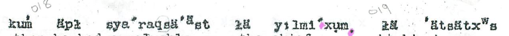
#### 🧪 Synthetic Data

##### ✍️ Text

Because of limited human capacity, I didn’t have a lot of ground truths, so I sought to create synthetic data (something that is common in OCR pipelines for indigenous languages ([Carrera et al, 2024](https://aclanthology.org/2024.americasnlp-1.11/) & [Enstad et al,2025](https://arxiv.org/pdf/2501.07300?))).

Because I already had about 292 unique words transcribed, I built novel words based on patterns found within them. To do this, I used [Markovify](https://github.com/jsvine/markovify), which uses state sizes to build sentences based on the pattern of n words before it. However, I had to modify it so it looks at the character level instead of the word level. To do that, instead of splitting the text file (gathered sentences from all my ground truths) by sentences, I split it by words. Traditionally, the model would take each sentence, split it into words, and perform its magic in word order. But with only feeding it a word per line, it split the words into characters and learned from there.
Some good examples resembling real words include:
tcäsṕä’ᵃ̈

tcä appears in 25/292 words, and the ending of ä’ᵃ̈ appears in 31/292 words, and word-finally in around 10/292 words. It learns the patterns in which words appear and adds onto them, etc.

I chose order 3 for originality while keeping trending patterns - because of only 292 words, I didn’t want it to be repetitive. I also found the higher the order, the more it repeats or returns None (which it does when the state size is too for the selected character length) - so at state size 4, after being prompted to generate 500 words, only 394 words were not None, and out of that, only 121 were unique (only 30% of words generated were unique). But with state size 3 with prompting 500 words, all were None, and 390 were unique (78% unique).

I decided to generate 1000 words, 656 generated words for the novel, and when combined with my 292, I got 946 words.

#####  📸 Images

As mentioned, the scanned documents were poor photocopies, with jagged edges, blurred text, and fuzzy backgrounds. I mimicked that in my synthetic data using [Augraphy](https://augraphy.readthedocs.io/en/latest/index.html), a Python image augmentation package.

As I learned through other experiments, I didn’t want to make the text match the chaotic nature of the ground truth documents, because it struggled to learn, so I only used a few alterations.
For this, I used the setting.
- [LowRandomInkLines](https://augraphy.readthedocs.io/en/latest/doc/source/augmentations/lowinkrandomlines.html)
- [InkBleed](https://augraphy.readthedocs.io/en/latest/doc/source/augmentations/inkbleed.html)
- [LetterPress](https://augraphy.readthedocs.io/en/latest/doc/source/augmentations/letterpress.html)
- [DirtyDrum](https://augraphy.readthedocs.io/en/latest/doc/source/augmentations/dirtydrum.html)
- [SubtleNoise](https://augraphy.readthedocs.io/en/latest/doc/source/augmentations/subtlenoise.html)
- [Scribbles](https://augraphy.readthedocs.io/en/latest/doc/source/augmentations/scribbles.html) - this is because the documents had handwritten notes in the margins and slash marks - I wanted the model to learn around that

I also chose different fonts, though it was hard to find a typewriter font that allowed the unique characters. I needed a variety, so I did:
- Charis (Bold and regular)
- Duolis SIL

Here are some examples:

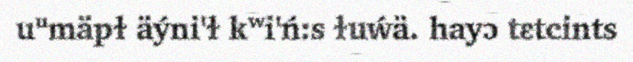

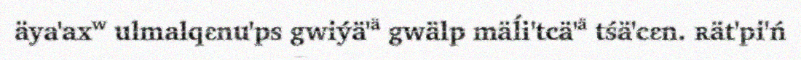

##### Data going into the model

I generated 3000 synthetic images and saved them into a Dataset object, then split them into Train and Test
2,400 images used for training
600 used for test

### 🏃‍♀️ Running the model

#### 🔤 Processor
The Microsoft/trocr-base-printed TrOCR processor is responsible for tokenizing the text and mapping features. However, it wasn’t trained on my specific characters, so I had to add several to the tokenizers and adjust the decoder and config accordingly. At the end, the processor had 34 special tokens, including built-in Roberto special tokens like PAD and UNK, along with around 30 special characters like: u̥, ʷ, ɫ, ḿ

#### 🧐 Vision Encoder Decoder

As mentioned, there is also a need for a Vision Encoder Decoder, and for that, I also used `microsoft/trocr-base-print`. Originally, I was using `microsoft/trocr-base-stage1` as [NielRogg's example](https://github.com/NielsRogge/Transformers-Tutorials/blob/master/TrOCR/Fine_tune_TrOCR_on_IAM_Handwriting_Database_using_Seq2SeqTrainer.ipynb) showed, but after researching and reading articles, I was advised that base-stage1 was not the best. So I ran it again - however, the results were pretty similar, so I’m not sure it really made a difference.

#### 📍 Mapping the Data
Based on [NieleRogg's example](https://github.com/NielsRogge/Transformers-Tutorials/blob/master/TrOCR/Fine_tune_TrOCR_on_IAM_Handwriting_Database_using_Seq2SeqTrainer.ipynb) of finetuning a TrOCR model, I built the Phonetic class, which maps tokenized items and image processing to the dataset, then feeds it into the Sequence training model.

#### 🧗‍♂️ Training arguments and Trainer settings
While I used several parameters standard for OCR, a few notable parameters include:

Num epochs: 25. Honestly, I had tried running 50, and it either gave me a bad C.E.R. (like 80%) or returned padding when testing. At the time I did this, I didn’t realize it was because I had to go back several checkpoints before the CER sharply took off (for some reason, early stopping wasn’t working.) I want to try again at 50.

Optimizer: adafactor to better improve memory and tracking

Report to: Tensorboard to better visualize my results

I also used dynamic padding via default_data_collator for the Trainer, which helped prevent excessive padding.

### 🔎 Finetuning and Testing
#### 🔧 Fine Tuning
To finetune the model, I ran it on 80 ground-truths (actual images from the book with manually annotated transcriptions) again with the base processor and model being outputs from the previous step.
The point was to fine-tune the model on what the documents actually look like, rather than the less messy synthetic data.
I then ran it on fewer epochs. I’ll go over it more in the results and error analysis sections.

#### ☑️ Testing
To test, I wrote a script that, as mentioned in finetuning, used the original model's previous outputs to run inferences on new data.

## Summary of individual contributions
<table>
  <thead>
  <tr>
    <th>Team member</th>
    <th>Role/contributions</th>
  </tr>
  </thead>
<tbody>
  <tr>
    <th><b>Sydney Greenspun</b></th>
    <td>All</td>
  </tr>
  <tr>
    <th><b>???</b></th>
    <td>???</td>
  </tr>
  <tr>
    <th><b>???</b></th>
    <td>???</td>
  </tr>
</tbody>
</table>

## Results

_See [the rubric](https://parsertongue.org/courses/snlp-2/assignments/rubrics/course-project/final/#results)_

I kept track of the Character Error Rate and Word Error Rate throughout training. When I first started this endeavor, I was getting horrible CER, and upon deep diving on the internet, I found that downgrading Transformers works - and it worked for me!

[I’m going to be completely honest here. I used TensorBoard, but the graphs didn’t look as pretty, and I only know the basics of matplotlib, so I asked Gemini to generate the graphs from my data. I did go through and verify all the data]

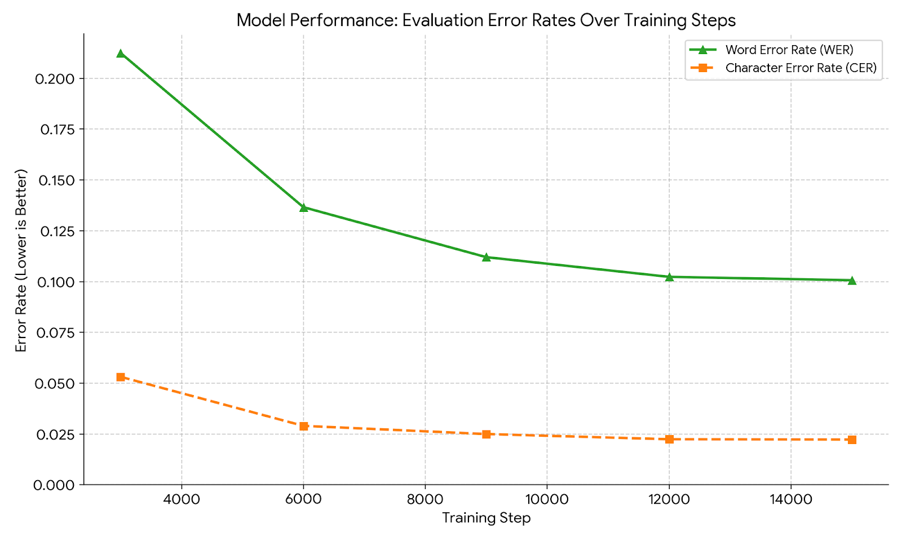

As seen, the model does relatively well as the epochs pass, with the final model having a CER of under .025 and a word error rate of .1. This means in each eval sample it gets about 2.5% of the characters wrong and calculates to 10% of words wrong. Not perfect, but not bad.

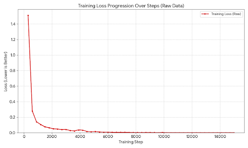

The training loss was also good, following the traditional pattern of a sharp decrease in the first few steps, then steadying out to a minuscule value of about 0. The ending training loss was .0002, pretty close to 0.

The evaluation loss follows a similar pattern.

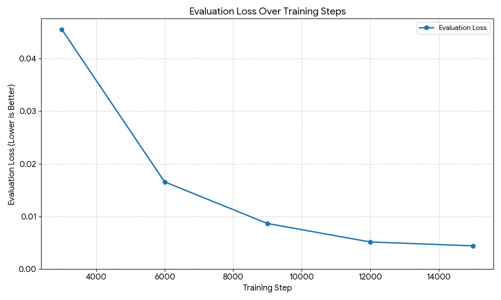

Although the model has low CER and WER, it didn’t perform great on novel examples. I’ll talk about that in error analysis.

Here is what I got after finetuning on ground-truths for 10 epochs.

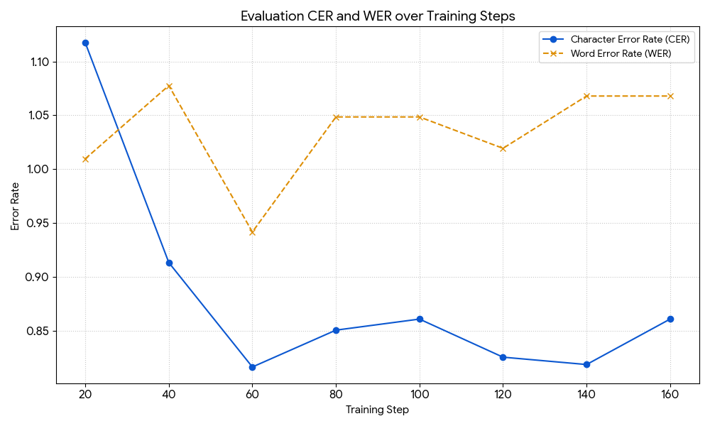

Both show horrible rates, with the lowest CER of .84, which, compared to the model I based it on (.02), suggests something wasn’t working.  I’ll talk more later about my theories.

## Error analysis

_See [the rubric](https://parsertongue.org/courses/snlp-2/assignments/rubrics/course-project/final/#error-analysis)_

### Testing on Synthetic data early
This did better than the fine-tuned model.
To test, I wrote a testing script and ran it on various ground-truths (where the words were trained into the model, but not the images).
#### Ground truths with all words being seen before
--- 
Ground Truths 1(notable features: blurry and background noise)
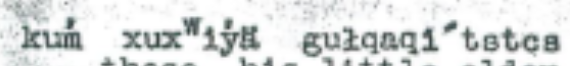
Actual Transcription:
kuḿ xuxʷiýä guɫqaqi' tstcs

OCR Prediction:
kuḿ xuxʷiýä guɫqaqi' tuptca

[Levenshtein Distance](https://planetcalc.com/1721/): 3 character edits 
[CER](https://taylorarchibald.com/cer/): 10.71% which is less than random which is good.
[WER](https://taylorarchibald.com/cer/): 25%

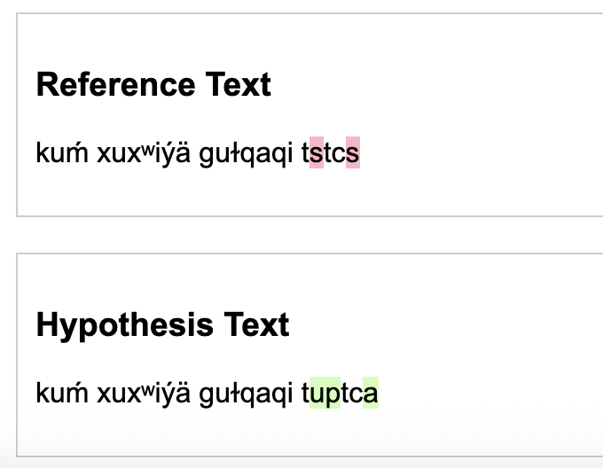
While it isn’t as low a CER as the model said, it isn’t too bad. As we’ll see, it tends to interpret s as either c’s, s’s, or u’s.
 ---
Ground truth 2 (Notable features: As seen, this is a much bolder text and with a lot of static.):

Actual Transcription:
tcil:dju'sɛnts kuḿ tćaḿ äya'a guĺ:nt'a'q́ʷsus. täto

OCR Prediction:
ta'xʷä'q́u'usɛntɛ hɔɫ tśaḿ äya'ʀ guĺu'a q́ʷsus. lä'a

[Levenshtein Distance](https://planetcalc.com/1721/): 24 character edits 
[CER](https://taylorarchibald.com/cer/): 42% 
[WER](https://taylorarchibald.com/cer/): 116% 
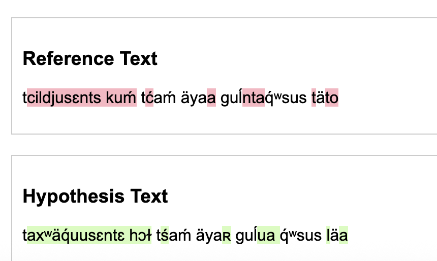

The ‘dj’ pattern is very rare, probably occurring only once or twice, which is why it couldn’t be predicted. Again, it confuses s’s and c’s. It also splits the second-to-last word.

---

#### Now to test on images with words not seen before (though a majority were seen)

New Truth 1:

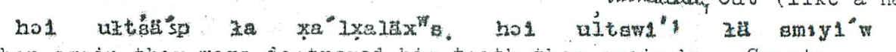
Actual Transcription:
hɔi uɫśä'sp ɫa x̥a'lx̥aläxʷs. hɔi uĺtswi'' ɫä sm:yi'w

OCR Prediction:
hɔi uttćänp äa. x̥ʷi'pɛlä'xʷa. hɔi. uɫtmi'l. ä. sm:yi'w

[Levenshtein Distance](https://planetcalc.com/1721/): 25 character edits 
[CER](https://taylorarchibald.com/cer/): 35.29% which is less than random which is good.
[WER](https://taylorarchibald.com/cer/): 62% Not good at all.
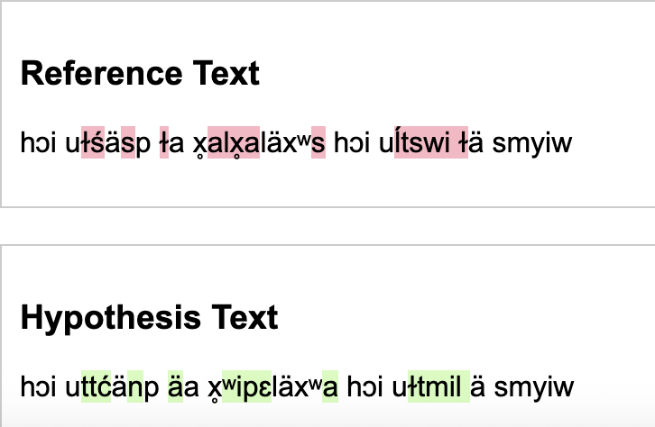

Again, on the longer words, it did worse, especially when they weren’t seen before.  It also added periods where there was static. Because ä are so frequent in the words, I have a feeling that is why it tends to get them so often.

---
New Truth 2: 

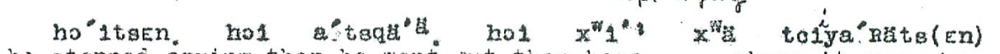
Actual Transcription:
hɔitsɛn. hɔi a' tsqä'ᵃ̈. hɔi xʷi'' xʷä tciya'ʀäts(ɛn)

OCR Prediction:
hɔ'tsɛn. hɔi. a'tapä'aᵃ̈. hut xʷi'' xʷä tcda'ätsɛm

[Levenshtein Distance](https://planetcalc.com/1721/): 14 character edits 
[CER](https://taylorarchibald.com/cer/): 23.40% which is significantly less than random, but again, not as well as the words it's seen often.
[WER](https://taylorarchibald.com/cer/):62.50%

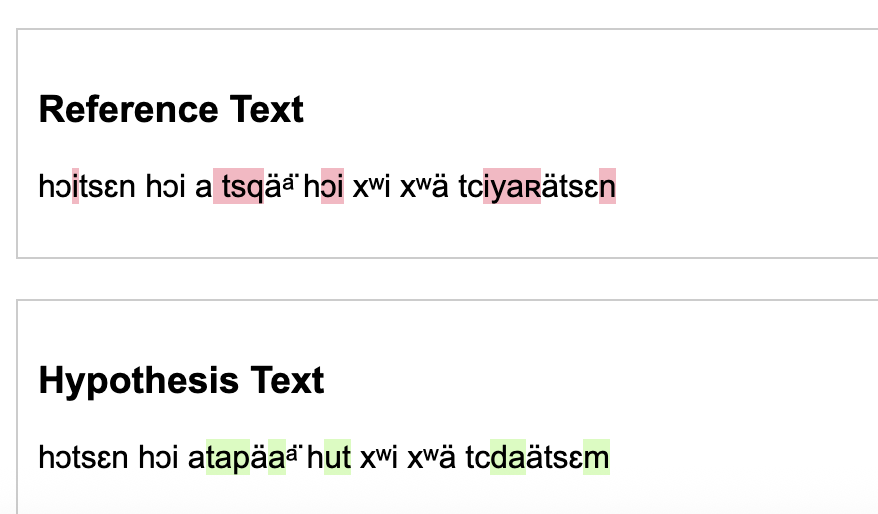

While I had remarked it did well with ä’s, it seems here it added too many ä’s. There were also very few parentheses in the ground truths and the documents, so it struggled to recognize them. It might have mistaken it for a scribble.

##### Working with the finetunes
These are tests on the same images from the above section, with unseen words.

Actual Transcription:
hɔi uɫśä'sp ɫa x̥a'lx̥aläxʷs. hɔi uĺtswi'' ɫä sm:yi'w
OCR Prediction:
äst'ɛnts. ɫa 'ä'tpɛn. hɔi uɫta'a'tśä'x̥ʷ

[Levenshtein Distance](https://planetcalc.com/1721/): 14 character edits 
[CER](https://taylorarchibald.com/cer/): 70.59% 
[WER](https://taylorarchibald.com/cer/):75.00% 

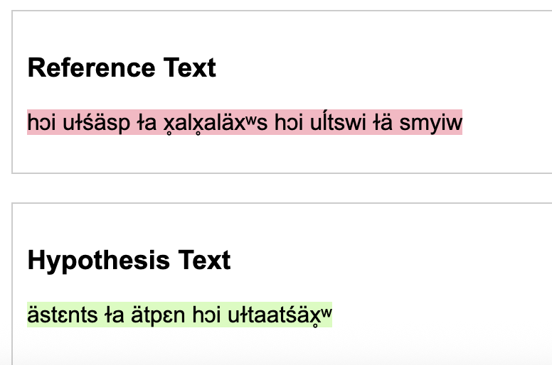

For this, it seemed to completely miss words at the beginning and end, and to mess up most words in between.
Maybe it is the small number of training sources (79 annotated images) or poorly chosen training arguments. I’m not quite sure.

## Reproducibility

_See [the rubric](https://parsertongue.org/courses/snlp-2/assignments/rubrics/course-project/final/#reproducibility)_
_If you'ved covered this in your code repository's README, you can simply link to that document with a note._

[README.md](https://github.com/uazhlt-ms-program/ling-582-fall-2025-course-project-code-indigenous-language-ocr/blob/main/README.md) I demonstrated reproducibility and set up file seeds.
I didn’t include specific versions besides Transformers because when I attempted to add them based on the pip list and reproduce it, I got errors. So I let the magic of pip handle it.

## Future improvements
_See [the rubric](https://parsertongue.org/courses/snlp-2/assignments/rubrics/course-project/final/#proposal-for-future-improvements)_

Firstly, I would add A LOT more manually annotated ground truth, and I plan to do so for further testing. Another thing is the data; even though I strived to represent rare character patterns, I don’t think I did well enough, as it performed poorly on novel patterns.  For testing, I would clean up the testing images to not be as hard to read.

Also, I might try to find a better processor that is trained on more similar data. Upon researching forums, I found suggestions to use the ROBERTA processor because it is larger and more trained on multilingual data that trocr-base-printed; however, that would require redoing the infrastructure of the project and starting over.

I’m also thinking of switching to Tesseract as it can do full pages at a time with decent accuracy (better than TrOCR). The Tesseract model had a similar CER when training, but better CER when tested on pages. However, as I would have to do if I did TrOCR, I need to split English and CdA to run the different English or CdA Finetuned models. Tesseract can handle multilingual parameters, but my testing didn’t go well.

In conclusion, adding more data will be benificial no matter which avenue I choose when continuing this project. Playing around with tokenizers and multilingual arangements could also help.