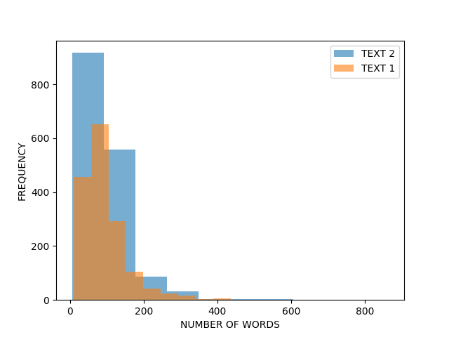
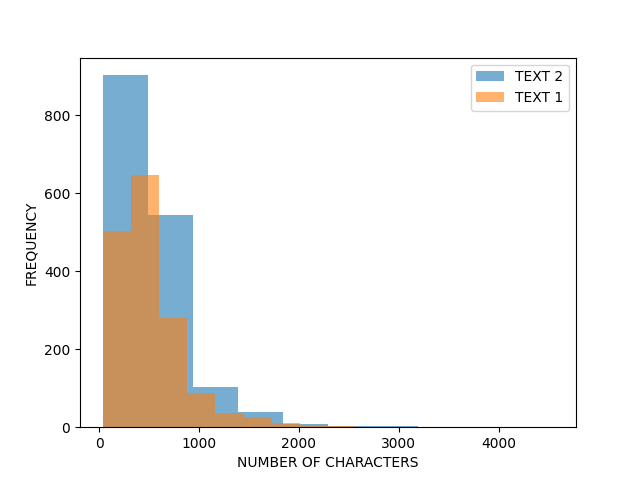
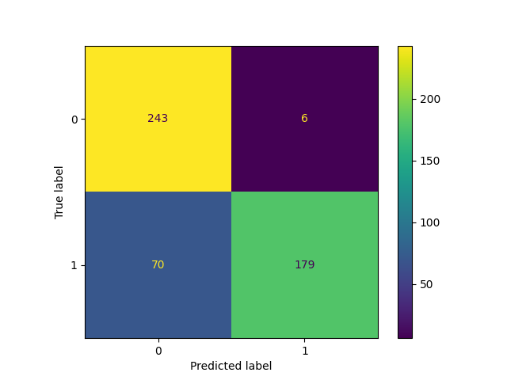

<table>
  <caption>
    Class Competition Info
  </caption>
  <thead>
  <tr>
    <th></th>
    <th></th>
  </tr>
  </thead>
<tbody>
  <tr>
    <th><b>Leaderboard score</b></th>
    <td>0.53273</td>
  </tr>
  <tr>
    <th><b>Leaderboard team name</b></th>
    <td>Tyler Schnoor</td>
  </tr>
  <tr>
    <th><b>Kaggle username</b></th>
    <td>tylerschnoor</td>
  </tr>
  <tr>
    <th><b>Code Repository URL</b></th>
    <td>https://github.com/uazhlt-ms-program/ling-582-fall-2025-class-competition-code-tschnoor</td>
  </tr>
</tbody>
</table>


## Task summary

_See [the rubric](https://parsertongue.org/courses/snlp-2/assignments/rubrics/class-competition/final/#task-summary)_

The class competition centers around _authorship attribution_, where one is tasked with determining whether or not two texts were written by the same or different authors. This is a challenging task, as a single author can write a great variety of things! An author's style may vary between texts or even between sentences. Their vocabulary may grow or shrink over time. Their interests may change, and the subjects they write about may change as a result. However, some characteristics of an author's writing may also remain consistent. I like to think that I would be able to recognize my favorite author's writing given a sentence with only limited context (please don't test me on that). You might like an author because of their writing style--something which very well may remain consistent from text to text. Or you might like the subject matter that your favorite author writes about. Perhaps they consistently write about space travel, goblins, or historical figures. Many of the typical approaches to authorship attribution try to extract features from written language that capture these consistencies (or lack thereof) to inform their predictions.

The data provided for this task was already split into train and test sets. Using the Pandas DataFrame data structure and minimal processing, we can create a dataframe with columns for the label (0 for different authors, 1 for the same author), and each text. The 0/1 label space makes authorship attribution into a binary classification task in this case. We start out with 1601 rows of training data (see below) and 899 rows of testing data. The Kaggle leaderboard score is determined by model performance on this testing set (though 20% of the test set is still held out until the very end to keep things interesting), for which we are not given the labels. We are not given much information about how this data was extracted, exactly, but we do know that the majority of the data comes from [Project Gutenberg](https://www.gutenberg.org/).

```Python-repl
>>> df
        ID  ...                                              TEXT2
0        0  ...   How big is a spation in space?" "Van Manderpo...
1        1  ...   Daddy was always shushing her.... But who was...
2        2  ...   Do you mind if I stroke one of your paws—hand...
3        3  ...   And, despite the strangeness of their surroun...
4        4  ...   You'd think that after a year I would have re...
...    ...  ...                                                ...
1596  1596  ...   Their erect posture gave them a weirdly half-...
1597  1597  ...   The fugitive passed close by us, and Jack sho...
1598  1598  ...   "I'll make him wait!" Stoutly your pot-bellie...
1599  1599  ...   Dance, you parts of me, you living things, yo...
1600  1999  ...   I’m very sorry for all the trouble I’ve cause...

[1601 rows x 5 columns]
>>> df.columns
Index(['ID', 'TEXT', 'LABEL', 'TEXT1', 'TEXT2'], dtype='object')
```

### Challenges of the task (examples)

I have already written about some of the challenges of this task, but would like to illustrate with a couple examples from the training set.

#### Similar vocabulary does not necessarily come from the same author
Both of the texts below describe a character who handles a pipe. Given that pipe-smoking is rare in the modern day, a feature that captures common content words--particularly if it also accounts for rarity--might strongly indicate shared authorship. But these texts are written by different authors!

_This example also illustrates how parsing errors can sneak into the data and complicate matters. Note the page number in text 2!_
```Python-repl
>>> df["TEXT1"][27]
'"I had forgotten that they were circular." "That is because of the pressure. A circle presents the best resistance," and picking an odd envelope from his pocket, he made the following sketch and passed it to me. I nodded as I recognized the cross-section. "Now the plan of the thing is like this," he added, putting aside his pipe and pulling a sheet of paper from the corner of his desk. Rapidly, with all his old accuracy, he sketched the main plan and leaned over as he handed it to me. "You see," he explained, picking up his pipe again, "both pumps work at one time—in fact, I should say all four, because this plan is duplicated on the English side. On both ends then, a train is gently pushed in by an electric locomotive. A car at a time goes through the gate so that there is a cushion of air between each car. '
>>> df["TEXT2"][27]
' We\'ll only be a mile and a half away, and that\'ll be too close to fifty kilos[Pg 6] of negamatter if the field collapses." "It\'ll be all right," Pitov assured him. " The bugs have all been chased out years ago." "Not out of those generators in the rocket. They\'re new." He fumbled in his coat pocket for his pipe and tobacco. " I never thought I\'d run another nuclear-bomb test, as long as I lived."'
>>> df["LABEL"][27]
0
```
#### Similar lengths do not guarantee shared authorship
I use features for both the difference in number of characters and the difference in number of words in my model, but this example illustrates that a similar length does not guarantee anything. 
```Python-repl
>>> len(df["TEXT1"][1211].split())
107
>>> len(df["TEXT2"][1211].split())
109
>>> df["LABEL"][1211]
0
```

## Exploratory data analysis

_See [the rubric](https://parsertongue.org/courses/snlp-2/assignments/rubrics/class-competition/final/#exploratory-data-analysis)_

Here is some additional information about the data. First, the distribution of data between classes:
```Python-repl
>>> df["LABEL"].value_counts()
LABEL
0    1245
1     356
Name: count, dtype: int64
```
This shows that there are far more cases of different authorship than shared authorship. I describe how I address this disparity in the next section.

I realized early on that most of the data come from what appear to be fictional stories. For example:
```Python-repl
>>> df["TEXT1"][100]
'But you\'re not the only person who has psi ability. I\'ve wired General Sanfordwaithe to send me another fellow; one who will coöperate." The Swami thought it over. Here he was with a suite in a good hotel; with an army lieutenant to look after his earthly needs; on the payroll of a respectable company; with a ready-made flock of believers; and no fear of the bunco squad. He had never had it so good. The side money, for private readings alone, should be substantial. Further, and he watched me narrowly, I didn\'t seem to be afraid of the cylinders. '
```
However, these snippets do seem to span genres and styles:
```Python-repl
>>> df["TEXT2"][1599]
' Dance, you parts of me, you living things, you atoms of my dust! He had torn Esponito\'s photo from a newspaper. Now he let the colored balls drop and stuck the picture on the end of the rod. "This and that are one in kind. Servant rod, find me that!" He stretched out the rod and turned on his heels. He sang and blanked his mind and listened to the tremors in his hands.'
```

I was also interested in how long these text snippets generally were, both in terms of characters and words. The figures below illustrate that the distribution of length is pretty severely skewed in the dataset. There are far more short snippets than long snippets, and the snippets in the TEXT2 position are generally longer than TEXT1 for some reason. I also address this in the next section.

<!-- <div style="display:flex; align-items:center;">
  </img>
  </img>
</div> -->
 


## Approach

My approach for the class competition is to engineer a set of (more or less) interpretable features for use as input to a simple authorship classifier. I wanted to spend my time on this assignment working on the data rather than model architecture because I devoted a lot of time on the class project to recreating specific neural network architectures. One motivation in taking this approach is to maximize interpretability so that the relative contributions of each of the features can be investigated. Contribution analyses can provide data that may be used to improve our approach to the task, but also have the potential to tell us more about the task itself. The process of engineering features forces us to think about how the task at hand might be approached by a human, which is, in itself, a useful exercise (and can be one of the first steps of the scientific process). Additionally, I wanted to address the abnormal distributions in the dataset (more negatives than positives, abnormal distributions of length) by supplementing with outside data.

### Features

_One decision that I made early on was to take the absolute difference between features. By this I mean that I didn't want TEXT1 - TEXT2 to yield a different value than TEXT2 - TEXT1. I think this is logical, as the difference between two texts does not change with their spatial arrangement. Thus I did not need to "flip" the dataset and calculate features again._   

- Length Difference: The difference between the number of words in Text A and Text B.
  - This feature is the naive difference in number of words between the two texts. This feature is not very useful in its current state, because we are not provided the method by which the texts were extracted for use in the dataset. I plan to improve this feature by extracting the number of words per sentence instead. This would give an idea of the average length of the sentences written by the author, which may be a characteristic that could be useful for differentiating authors.
- Number of Common Words: The number of words between the texts that are the same
  - The idea behind this feature is that an author is likely to reuse the same words in subsequent texts. So, if a high number of common words are found between two texts, the author is more likely to be the same.
- SBERT Sentence Embedding Similarity: The between two vectors of feature embeddings as produced by [SBERT](https://www.sbert.net). In this way I created 4 different similarity features, each calulated with a different algorithm (cosine, dot product, euclidean, and manhattan distance).
  - I wanted to take advantage of open source/open weight NLP models to create some features. The features created in this way have the disadvantage of being less interpretable (or perhaps the interpretation of the features is just made more complicated by the fact that one must investigate an additional model in the pipeline) but they carry the advantage of leveraging learned generalizations that come from training on very large amounts of data. This feature takes advantage of the SBERT tokenizer, the SBERT encoder, and the built-in simlarity calculation (which defaults to a dot product calculation). I plan to test out the other similarity calculations in the future.

### Data supplementation

I supplemented the given data with some from the [Victorian Era Authorship Attribution dataset](https://archive.ics.uci.edu/dataset/454/victorian+era+authorship+attribution) which was created by Gungor and Abdulmecit (full reference below). I took examples of shared authorship from these in order to equalize the amount of positive and negative examples. Additionally, this dataset uses longer snippets to compensate for the shorter length given in the competition data. Depending on the lengths of the mystery testing data, the addition of longer sections could be a benefit or detriment to model performance.

```
GUNGOR, ABDULMECIT, Benchmarking Authorship Attribution Techniques Using Over A Thousand Books by Fifty Victorian Era Novelists, Purdue Master of Thesis, 2018-04
```

As a note, I also tried masking random words in the training data as a form of augmentation with the goal of increasing training exposure. However, masking (at least the way I did it, replacing a random word with a [MASK] token) only ever seemed to decrease performance.

### Classifier and training

For classification, I used a simple logistic regression model. Although this model is not very complex relative to many neural network architectures, it is a tried and tested method of doing binary classification. I also tried training a simple multilayer perceptron network but I could never get its performance to exceed that of the logistic regression. 

The training procedure consisted of 10-fold cross validation on held out data. The results of training can be found in the next section.

## Results
_See [the rubric](https://parsertongue.org/courses/snlp-2/assignments/rubrics/class-competition/final/#results)_

**My highest leaderboard score:** 0.53273

**Delta:** +0.03012

|   FOLD |   PRECISION_POS |   PRECISION_NEG |   RECALL_POS |   RECALL_NEG |   F1_POS |   F1_NEG |
|-------:|----------------:|----------------:|-------------:|-------------:|---------:|---------:|
|      1 |        0.976077 |        0.788927 |     0.769811 |     0.978541 | 0.860759 | 0.873563 |
|      2 |        0.968586 |        0.798046 |     0.748988 |     0.976096 | 0.844749 | 0.878136 |
|      3 |        0.963731 |        0.829508 |     0.781513 |     0.973077 | 0.863109 | 0.895575 |
|      4 |        0.989583 |        0.800654 |     0.756972 |     0.991903 | 0.857788 | 0.886076 |
|      5 |        0.974619 |        0.82392  |     0.783673 |     0.980237 | 0.868778 | 0.895307 |
|      6 |        0.983784 |        0.840256 |     0.784483 |     0.988722 | 0.872902 | 0.908463 |
|      7 |        0.970149 |        0.821549 |     0.78629  |     0.976    | 0.868597 | 0.892139 |
|      8 |        0.976636 |        0.795775 |     0.782772 |     0.978355 | 0.869023 | 0.87767  |
|      9 |        0.965854 |        0.829352 |     0.798387 |     0.972    | 0.874172 | 0.895028 |
|     10 |        0.967568 |        0.776358 |     0.718876 |     0.975904 | 0.824885 | 0.864769 |

## Error analysis

_See [the rubric](https://parsertongue.org/courses/snlp-2/assignments/rubrics/class-competition/final/#error-analysis)_

The results of my 10-fold cross validation show that F1 holds pretty steady in the mid-to-high 80s for both negative and positive datapoints. This table also shows that negative precision is lower than positive precision and positive recall is lower than negative recall. Read: we're getting lots of false negatives.

To confirm that this is where our main problem lies, here is a confusion matrix:

<!-- <div style="display:flex; align-items:center;">
  </img>
</div> -->


The top left and bottom right boxes hold the highest occurences, which is good! But there are certainly more occurences in the bottom-left (false negatives) than the top-right (false positives).
## Reproducibility

_See [the rubric](https://parsertongue.org/courses/snlp-2/assignments/rubrics/class-competition/final/#reproducibility)_
_If you'ved covered this in your code repository's README, you can simply link to that document with a note._

Steps for reproducing my results can be found in my code repository's README [here](https://github.com/uazhlt-ms-program/ling-582-fall-2025-class-competition-code-tschnoor). Everything is containerized to make it easy.

## Future Improvements

_Describe how you might best improve your approach_

Although there are advantages to the approach I took, I do not think that it was optimal in terms of achieving a high F1 score on the test set. I was successful in extracting some useful features, but a more complex architecture would be better able to capture the complexity of the task (and handle a high-dimensional representation of the text snippets). If I had another opportunity to participate, I would spend less time engineering features and more time creating a neural network classifier. I could potentially use raw SBERT embeddings as the input representation and a separate transformer network for classification. I wanted to try fine-tuning an existing classifier as well, but ran out of time.

If I were to maintain my current simple architecture, I could still improve. I would engineer additional features and do a more intensive analysis of the contribution of each to model performance. Additionally I would investigate data augmentation techniques that would allow me to take full advantage of the given training data.