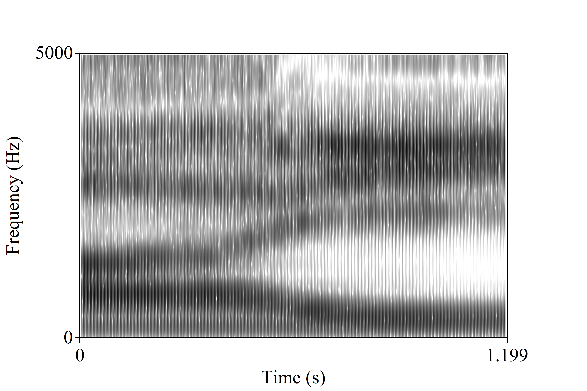
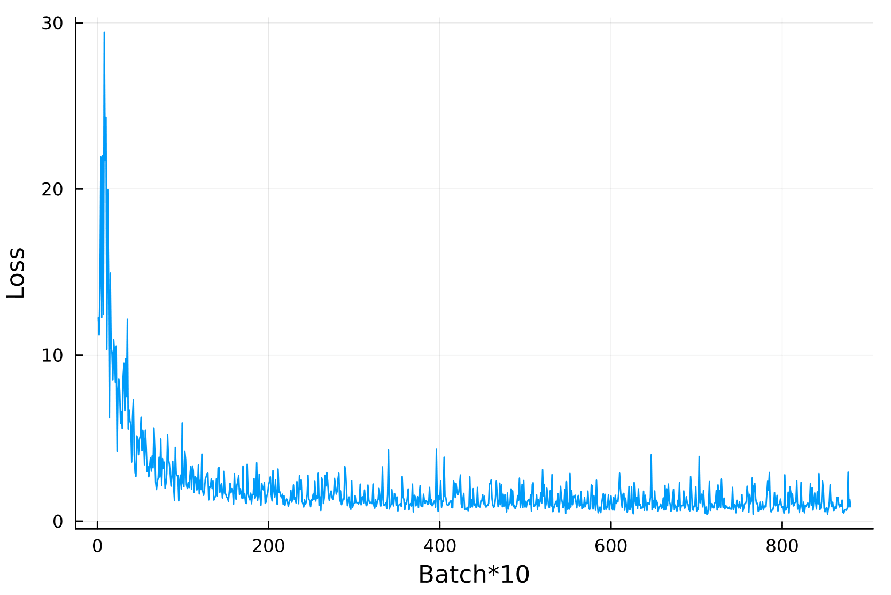
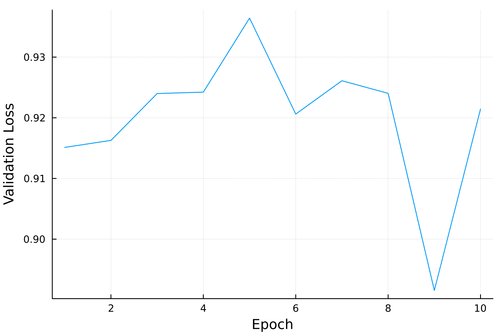
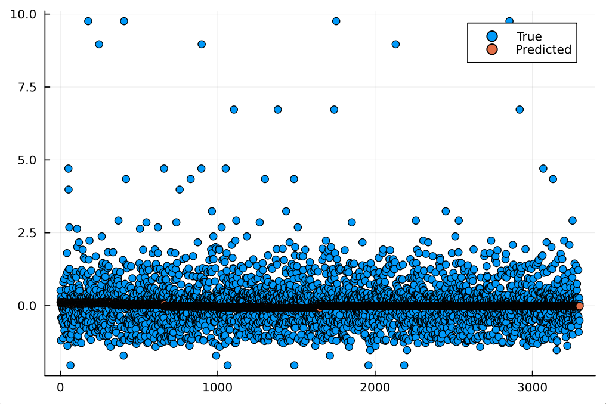
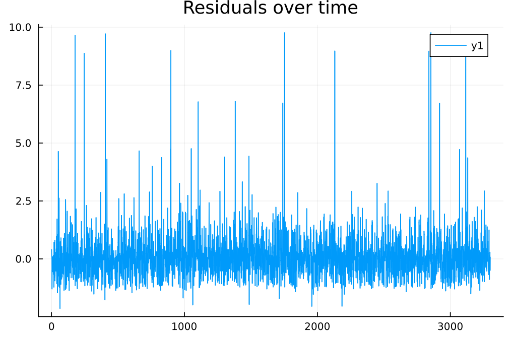

<table>
  <caption>
    Course Project Info
  </caption>
<tbody>
  <tr>
    <th>Code Repository URL</th>
  <td>https://github.com/uazhlt-ms-program/ling-582-fall-2025-course-project-code-ecog-speech-decoding</td>
  </tr>
  <tr>
    <th>Demo URL (optional)</th>
    <td></td>
  </tr>
  <tr>
    <th>Team name</th>
    <td>ECoG Speech Decoding</td>
  </tr>
</tbody>
</table>


## Project description

_See [the rubric](https://parsertongue.org/courses/snlp-2/assignments/rubrics/course-project/final/#reproducibility).  Use subsections to organize components of the description._

### Overview
This project aims to make a neural network electrocorticography (ECoG) formant decoder. ECoG signals are obtained by implanting hundreds of small electrodes deep within the brain to record electrical activity. This methodology has the potential to be useful in a variety of practical applications, particularly as a brain-computer interface. One area of interest is in restoring speech communication by decoding ECoG signals and using the decoded features to reconstruct an acoustic signal. Artificial neural networks are the current standard for ECoG decoding.

The specific aim of the project is to create a neural network ECoG decoder that decodes ECoG -> normalized formant frequencies. For example, the model might take a window of 32 samples of 15 x 15 electrode readings as input and its task would be to predict the frequencies of the first two formants at the end of the window. I aim to use a modified version of the [ResNet](https://openaccess.thecvf.com/content_cvpr_2016/html/He_Deep_Residual_Learning_CVPR_2016_paper.html) architecture for the decoder, heavily inspired by the study described below. The intention behind this system is to use it in conjunction with an acoustic waveguide model of the vocal tract to simulate speech. The end result would be a more interpretable pipeline from cortical signals to speech that could be used to model the entire speech production process.

<!-- <div style="display:flex; align-items:center; flex-direction: column">
  </img>
  <p>The formants are the dark bands in this image, called a spectrogram.</p>
</div> -->


The formants are the dark bands in this image, called a spectrogram.

### Related work and the state of the art
The gold standard of speech restoration is real-time decoding and reconstruction so that a speech neuroprosthesis can be used to communicate in a naturalistic way. The data used in this project come from a study by [Chen et al. (2024)](https://doi.org/10.1038/s42256-024-00824-8) that represents one of the most recent innovations in the field. The data are constituted by ECoG signals, audio recordings, and some derived features of the audio (e.g., formant tracks) that were all collected while the participants spoke words aloud. The study aimed to create a real-time speech neuroprosthesis that could restore speech communication for people with severe motor impairments. Their methodology involved training two neural networks with different purposes. The first was an ECoG -> Speech features decoder. The next network was a speech auto encoder that reconstructed an acoustic signal from the decoded speech features. The present project focuses on the first of these two networks, though I certainly grew to appreciate the necessity of the second (see section "Challenges of the task"). 

<div style="display:flex; align-items:center; flex-direction: column">
  </img>
  <p>An overview of the Chen et al. study.</p>
</div>

### Novelty and motivation

This project uses interpretable acoustic features as the speech representation. This is in contrast to most approaches, which use abstract features or features which are only loosely related to certain qualities of spoken language. An additional novelty associated with this project is the intention to use decoded features with an acoustic waveguide model. A full description of the acoustic waveguide algorithm is outside the scope of this blog post, but the model can be thought of as a physics-based model of speech. It can synthesize intelligible speech, much like other models can, but it is also a _simulation_ of speech, as it calculates the propagation of pressure waves through a digital vocal tract. The model is therefore useful for doing science because its parameters and calculations are interpretable analogues to natural speech production.

Such a model also has its drawbacks. For one, it is only useful if it can be controlled. Choosing the right parameters to emulate a speech recording is a labor-intensive and finicky task. The vision with this project is to decode one of the parameters for the model automatically from cortical activity so that the speech chain (from brain to acoustics) can be studied.

There would also be significant practical applications for such a pipeline. As in the previously described paper, an ECoG decoder + speech synthesizer pairing could provide real-time speech restoration to those with a speech impairment. Using a waveguide model would also provide significant benefits here over other synthesis methods. For example, if the BCI user is young and still growing but has already lost the ability to speak naturally, the model parameters could be adjusted to scale the size of the vocal tract with age, producing a deeper, more age appropriate fundamental frequency. Achieving the same effect with a different system may require artificially lowering the pitch of training data and then retraining networks, which would require far more work and likely yield a less natural result.

### Challenges of the task

This is a highly challenging task that is unlikely to be performant in a condensed form like this project. The first challenge is that the task involves the extraction of interpretable but low-dimensional information from high-dimensional cortical signals. The fear is that the desired information could get "lost" in all of the input data.

Neurosignal decoding is an inherently difficult task because it is noisy. There is no guarantee that a particular electrode channel or region of electrode channels correspond to any particular feature. Signals can be complicated by a distracted participant, a participant error, faulty electrode, or interference from other equipment.

Perhaps the most significant challenge (and it is one that I didn't know about until I had started this project) is that the formant tracks provided by the authors are extremely innacurate. At first I assumed that, because the authors experienced such success with their system, the formant tracks--which are used as input parameters to their own speech synthesizer--must be quite accurate. However, I failed to account for just how much the network could compensate for formant tracking errors. The "black box" nature of their system means that it is difficult to say how much information their synthesizer even gleans from the formant parameters. It may simply rely on the other, more accurate parameters to synthesize speech. The beauty of the two-network system is that the speech synthesis network can learn to compensate for inconsistencies in provided parameters. It accomplishes this by comparing its output to the natural recording directly, through Short-Time Objective Intelligibility loss.

**A note about why I didn't proceed with the plan to make a vowel classifier**

In my original proposal, I proposed a project that centered around making a vowel classifier with ECoG inputs. However, I soon realized that I did not have enough examples of each vowel (<100 each) to train a good model. The project I went with also didn't really work, so I am sort of second-guessing changing course. Regardless, I felt like I should explain myself.

### Procedure

Here is a list of things that I did as I tried to make this project work:
- I varied the window and step size
  - I tried variations with 64 samples per window down to 32 samples per window (they use 64 in the reference paper)
  - I tried different step sizes from 1 to window_size/2
- I varied the architecture
  - I tried with the architecture presented in the paper
  - I tried with a simplified architecture (~30% of layers removed)
  - I tried with different numbers of channels in the convolutional layers
  - Overall, simpler seemed to be better, which makes sense given the amount of overfitting you are about to see in the next section
- I tried modeling the formant values as time series rather than a stationary target
  - This involved swapping the dense layers at the end with more convolutions that reduced the size down to the desired 2 x 1
  - This didn't seem to help at the time, but I should try this again in combination with some of the other changes I made.
- I made sure to normalize and center the formant values around zero. This places most of the data between -1 and 1
  - I didn't try using the raw formant values, but I imagine that would have made things worse

_Note: There is no residual block layer built in to Flux.jl, which is the main machine learning library in Julia. I wrote my own but based it heavily on [this implementation](https://github.com/pxl-th/ResNet.jl) by Anton Smirnov. The main difference being that his is meant for 2D image data, while mine is adjusted to work with 3D "video" data. 

<!-- ## Archive (from draft assignment)
_*Note that some aspects of the project changed since I wrote this._
### Goals
<i>Subsequent goals can only be achieved if the model achieves satisfactory performance after the first goal is finished. However, I believe that accomplishment of the first goal satisfies the demands of this course project.</i>
1. The primary goal of this project is to train a simple neural network ECoG decoder that classifies signals into vowel categories.<br></br>
   - A subgoal is to test model performance when trained on different data windows. Specifically, I plan to test a window that contains all information for a single vowel and a shorter, 25 ms window size.
2. The secondary goal of this project is to conduct a contribution analysis of the electrodes from which cortical signals are obtained.
3. The final goal is to examine whether the results of the contribution analysis can be explained by a theory of speech production that describes phonetic segments as resonance deflection patterns.

The proposed procedure will be described in detail in the next section. -->

<!-- #### Procedure -->


<!-- #### Scope
This project is intended to be a small preliminary investigation that could lead to a more comprehensive study. Thus, I intend to set firm limits so that the scope of the study does not balloon beyond what would be appropriate for this course project. 

The first limit I am setting is a limit on the training/testing data. I will only be using ECoG signals collected during the production of vowels in this study. This limit presents the network with an easier classification task and reduces the amount of time I need to spend segmenting, annotating, and extracting data from the continuous signals. I will begin by extracting data from only two vowels (/i/ and /u/) but if time allows, I may add additional categories (e.g., /a/). Although the annotation of additional vowels would certainly take more time, it is currently unknown whether the addition of more vowels will help or hinder the training process. Adding more categories may make the inference task more difficult, but would also provide more data from which the network can learn to generalize.

I will also limit the architecture used in this project. The findings of [Chen et al. (2024)](https://doi.org/10.1038/s42256-024-00824-8) suggest that the ResNet architecture [(He et al., 2015)](https://openaccess.thecvf.com/content_cvpr_2016/html/He_Deep_Residual_Learning_CVPR_2016_paper.html) is effective for decoding ECoG signals. Although the methodology used in this study is different from that used by Chen et al., (real time speech restoration vs. classification), I hypothesize that the advantages offered by the architecture make it a good fit for this project. That being said, I may make smaller adjustments to the architecture used in the aforementioned paper (e.g., to the number of layers).

The final restriction that I will place on this study is a restriction on the amount of analysis done on the network and inference results. I plan to only test a few different electrode groupings in the contribution analysis. I will also only do a brief qualitative examination of whether the contribution of electrodes can be explained by resonance targets.

An important part of preventing the scope of this project from ballooning is my intention to build a "vertical slice" of the modeling process first, then adding complexity as time allows. The vertical slice will consist of a small training set of only two vowels, a minimal implementation of the ResNet architecture used by AUTHORS et al., and a surface-level analysis of classification accuracy. The goal is for this vertical slice to satisfy the requirements of the course rubric as the first priority.

### (Rough) Timeline

<table>
  <thead>
    <th>Week</th>
    <th>Week End Date (Friday)</th>
    <th>Tasks</th>
    <th>Status</th>
  </thead>
  <tbody>
    <tr>
      <td>1</td>
      <td>Nov. 14</td>
      <td>
        - [x] Get code repository set up <br></br>
        - [x] Write project proposal in this markdown document <br></br>
        - [x] Submit pull request with course project proposal by <b>Nov 17</b>
      </td>
      <td>Finished</td>
    </tr>
    <tr>
      <td>2</td>
      <td>Nov. 21</td>
      <td>
        - [ ] Finish data annotation <br></br>
        - [ ] Extract full segments and save to files <br></br>
        - [ ] Extract windowed segments and save to files <br></br>
        - [ ] Establish vertical slice of ResNet modeling architecture <br></br>
        - [ ] Train network using full vowel segments <br></br>
        - [ ] Train network using windowed vowel segments <br></br>
        - [ ] Work on blog post
      </td>
      <td>In-Progress</td>
    </tr>
    <tr>
      <td>3</td>
      <td>Nov. 28</td>
      <td>
        <i>Leaving this week somewhat open to adapt to whatever goes wrong in previous weeks.</i><br></br>
        - [ ] Tweak architecture<br></br>
        - [ ] Tweak input data (augmentation?)<br></br>
        - [ ] Work on blog post
      </td>
      <td>Not Started</td>
    </tr>
    <tr>
      <td>4</td>
      <td>Dec. 1</td>
      <td>
        - [ ] Contribution analysis of electrode signals <br></br>
        - [ ] Investigate whether electrode contributions can be accounted for by resonance deflections (only possible if network performs well) <br></br>
        - [ ] Work on blog post
      </td>
      <td>Not Started</td>
    </tr>
    <tr>
      <td>5</td>
      <td>Dec. 8</td>
      <td>
        - [ ] Write up results<br></br>
        - [ ] Write up limitations<br></br>
        - [ ] Write up future directions<br></br>
        - [ ] Submit pull request with complete course project by <b>Dec 7</b>
      </td>
      <td>Not Started</td>
    </tr>
  </tbody>
</table> -->

## Summary of individual contributions
<table>
  <thead>
    <tr>
      <th>Team member</th>
      <th>Role/contributions</th>
    </tr>
  </thead>
  <tbody>
    <tr>
      <th><b>Tyler Schnoor</b></th>
      <td>Everything</td>
    </tr>
  </tbody>
</table>


## Results


_See [the rubric](https://parsertongue.org/courses/snlp-2/assignments/rubrics/course-project/final/#results)_

Below are the results of my best training run. The training loss, logged every 10 batches can be seen on the left, while the validation loss by epoch on a 20% holdout set is shown on the right. These show that the loss never drops below ~0.9. That is high considering that it is plots show RMSE. 

<!-- <div style="display:flex; align-items:center; flex-direction: row">
  </img>
  </img>
</div> -->


Unfortunately, upon closer evaluation, it is obvious that the model has simply learned to predict the mean:
<!-- <div style="display:flex; align-items:center; flex-direction: column">
  </img>
</div> -->


## Error analysis

_See [the rubric](https://parsertongue.org/courses/snlp-2/assignments/rubrics/course-project/final/#error-analysis)_

Error analysis gets a little awkward now that we know the model is just guessing ~0 every time. Even still, I'm going to go through the motions. Here are some error measurements on the first formant, for example.

```Julia-repl
julia> mae  = mean(abs.(y_true .- y_pred))
0.5873926876750887

julia> rmse = sqrt(mean((y_true .- y_pred).^2))
0.9436236172835178

julia> mape = mean(abs.((y_true .- y_pred) ./ y_true)) * 100
229.95062746555342
```

Because we have two timeseries to compare, it makes sense to look at the residuals between them. This plot just shows that the residuals are largely unchanging. The spikes occur when we get outliers from bad formant tracks.

<!-- <div style="display:flex; align-items:center; flex-direction: column">
  </img>
</div> -->


## Reproducibility

_See [the rubric](https://parsertongue.org/courses/snlp-2/assignments/rubrics/course-project/final/#reproducibility)_
_If you'ved covered this in your code repository's README, you can simply link to that document with a note._

I have containerized my code. To reproduce my results, follow the instructions in the README [here](https://github.com/uazhlt-ms-program/ling-582-fall-2025-course-project-code-ecog-speech-decoding).

## Future improvements

_See [the rubric](https://parsertongue.org/courses/snlp-2/assignments/rubrics/course-project/final/#proposal-for-future-improvements)_

Ultimately, this project did not work. The system is severely limited by the inaccuracy of the formant values on which it was trained. In addition, a 2 x 1 (two formant values per window) representation of the speech process may not be descriptive enough for this sort of task. As seems to so often be the case, I also think I was limited by the amount of data I had to work with. Even though I could extract thousands of windows to train the model, many of these windows were similar to one another (sliding windows with a step size of one, for example) and may have starved the system of real diversity. I can also now see that drastically reducing the dimensionality of the speech representation from many features to only two AND keeping the complexity of the model high was a bad call. I did reduce this complexity in later runs, but obviously there is more work to be done.

These limitations could be improved upon. Formant tracks could be manually corrected or automatically extracted through more robust means. I also think that a more rich representation of the speech signal would aid training (e.g., if the rest of the parameters for the waveguide model could be used as our "y"). Although I did test some of these parameter changes, it would also be interesting to do a more comprehensive evaluation of optimal window sizes, step sizes for sliding windows, feature channels in the convolutional layers, etc. More specifically, my best results came from simplifying the model, so I'd like to do this more and record the results. Unfortunately, unless the authors of the source paper begin to feel more generous, it is unlikely I will obtain more of this already rare data. However, there are many things I could do to refine the data that I do have access to. Or, one next step could be devising my own speech autoencoder, but using acoustic waveguide parameters.